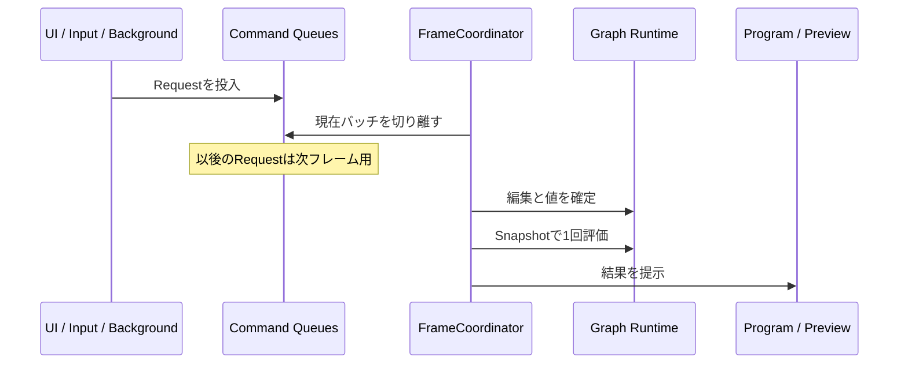

# フレームライフサイクル

## 状態

確定。`FrameCoordinator` の駆動位置、キュー境界、1評価フレームの処理、異常時の継続およびバックグラウンド完了通知の適用順を定める。

## 目的

- 仕様で確定した9段階を、実装上も1つの順序へ固定する。
- 評価中にグラフ、パラメーター、論理入力またはリソース所有が変化しないようにする。
- ProgramとPreviewが同じフレームの一貫した状態を参照するようにする。
- ノード単位の障害がフレーム全体または独立した枝を停止させないようにする。
- フレーム全体の予期しない障害でも、最後の正常なProgramと後処理を守る。

## 駆動方式

Bootstrapに `ApplicationLoopDriver` MonoBehaviourを1つだけ置き、その `LateUpdate` から `FrameCoordinator.Tick()` を1回呼ぶ。

- Input SystemとUIがUpdate中に発行した要求を、同じPlayer FrameのLateUpdateで切り離せる。
- ノード、動画、SceneおよびPhysicsを個別MonoBehaviourのUpdateで進めない。
- ノード評価、Camera Render Requestおよび出力提示を `FrameCoordinator` の管理下へ集約する。
- `Tick` の再入を禁止し、前回Tickが完了する前に次のTickを開始しない。
- `FrameNumber` は `Tick` 開始時に1増加し、Unityの `Time.frameCount` とは別に管理する。
- 初期版ではPlayerLoopの独自書き換えを行わない。LateUpdateで仕様を満たせないことが計測または実機検証で確認された場合だけ再検討する。

## フレーム境界

フレーム境界は `FrameCoordinator.Tick()` の開始とする。開始時に、対象キューを短い排他区間で現在バッチへ切り離す。

- 切り離し後に到着した要求は次の評価フレームへ送る。
- Producerはキュー投入の成否だけを受け取り、適用完了とはみなさない。
- UIのPending表示は、Application Read Modelが適用成功または拒否結果を公開するまで維持する。
- キュー上限で受理できない要求は投入時に拒否し、受理済み要求を後から破棄しない。

## 1評価フレーム

仕様の9段階を次の実装フェーズへ固定する。

### Phase 0: Boundary Intake

- `FrameNumber` と現在の単調時刻を確定する。
- Graph Edit、Parameter Update、Runtime Command、Completionの各キューを切り離す。
- 前フレームの非同期破棄完了を回収する。
- GraphClock Pause／Resume、Feedback Resetなど、評価開始前に必要なRuntime Commandを適用する。
- Completionは対象IDとRevisionを検証し、現在も有効なものだけRuntime Handleへ反映する。
- 古いCompletionは状態へ適用せず、所有する一時リソースだけを安全に解放する。

Phase 0は評価準備であり、ProjectDocumentのグラフまたはBaseValueを直接変更しない。

### Phase 1: Graph Edit

- 現在グラフからフレーム内限定のGraph Batch Workspaceを作り、GraphEditCommandをキュー順に1件ずつ検証する。
- 各Commandは個別に原子的とし、成功候補の結果をWorkspaceへ反映して次のCommandを検証する。
- 失敗Commandだけを拒否し、同じバッチの独立した後続Commandは検証を続ける。
- 成功候補をすべて反映したWorkspaceから `EvaluationPlan` を1回構築する。
- Plan構築成功後にだけ、成功候補のGraphPatchをProjectDocumentへ順番どおり確定し、Document Revision、State TokenおよびGraph Revisionを更新する。
- Plan構築が内部不変条件により失敗した場合はWorkspace全体を破棄し、成功候補も確定しない。
- 削除ノードは評価対象から直ちに外し、Runtime HandleをRetiringへ移す。
- 成功候補がない場合はPlanを再構築しない。
- 確定後のPlan構築をやり直さず、Workspaceから作ったPlanを新しいGraph Revisionへ対応付ける。

### Phase 2: Parameter and Control Commit

- Parameter、Value、PresetTriggerイベントをSequenceNumber順で処理する。
- 合流可能な連続更新は、同じ対象と操作単位の最新値へまとめる。
- PresetTriggerとPreset Transactionは合流せず順序を維持する。
- Presetは全項目を事前検証し、1項目でも無効ならそのPreset全体を拒否する。
- 同じパラメーターへの有効な更新は最大SequenceNumberを採用する。
- BaseValue確定後に変更通知用のChange Setを作るが、ノード評価はまだ開始しない。

### Phase 3: Frame Snapshot

- GraphClockをPhase 0で確定した単調時刻から1回だけ更新する。
- 確定したBaseValue、Value式、Preset結果から全EffectiveValueを1回計算する。
- `FrameSnapshot` を作り、以後Phase 9完了まで変更しない。
- EffectiveValue計算失敗は対象パラメーターの診断と仕様上のフォールバックへ変換し、例外をフレーム外へ漏らさない。

### Phase 4: Output Demand

- Programを常に最高優先度の評価起点として追加する。
- Preview Viewer Hostが表示中で、かつ品質段階上そのフレームに更新期限が来たPreviewだけを評価起点へ追加する。
- Program、フォーカス中Preview、その他Previewの安定順位でDemandを作る。
- EvaluationPlanを逆方向へたどり、要求出力、解像度、アスペクト比および更新対象を統合する。
- Feedback出力が要求された場合、その履歴更新に必要な入力枝もCommit Demandとして追加する。
- 到達しないノードおよび要求されない追加出力を対象へ含めない。

### Phase 5: Resource Preparation

- 要求されたImageFrame出力とFeedback履歴について、必要なTexture Descriptorを決定する。
- 既存Leaseが同じDescriptorなら継続利用する。
- 初回または仕様変更時はRenderingモジュールへLease確保を要求する。
- 仕様変更では旧Leaseを残したまま新Leaseを準備し、正常な初回出力後にだけ差し替え可能として記録する。
- Lease確保失敗は対象ノードをFaultedとし、他の枝の準備を続ける。
- Scene生成、動画Prepareなど完了待ちの処理はブロックせずPreparingとしてPhase 6へ渡す。

### Phase 6: Node Evaluation

- EvaluationPlanの安定したトポロジカル順序で必要ノードを評価する。
- Programに必要な枝を先に、次にPreviewだけが必要とする枝を評価する。
- 1ノードにつき要求された出力集合をまとめ、1フレーム最大1回だけ `Evaluate` を呼ぶ。
- 必須入力を取得できないノードはEvaluateを呼ばずBlocked結果を作る。
- 任意入力を取得できない場合は既定値へ置き換え、UsingFallbackを入力状態へ記録する。
- Runtime Nodeへ渡した入力値とImageFrameは読み取り専用とする。
- Runtime Nodeは借用した自身の出力Textureだけへ書き込める。
- ノード例外をノード単位で捕捉し、Faulted結果と診断へ変換して次の独立ノードを続行する。
- Available、Blocked、Faulted、Preparingの結果を当該FrameNumberのキャッシュへ保存する。

### Phase 7: Feedback Commit

- Phase 6が通常完了した場合だけ、要求されたFeedbackのCommitを行う。
- Feedback入力の現在フレーム結果を次履歴Textureへコピーする。
- 入力を取得できない場合はTransparentBlackをコピーする。
- すべての対象Feedbackでコピーに成功した後、それぞれの前後Bufferを交換する。
- 個別Feedbackのコピー失敗はそのFeedbackだけをFaultedとし、成功済みの別Feedbackを巻き戻さない。
- フレーム全体が途中中断した場合は未Commitとし、前フレーム履歴を維持する。

### Phase 8: Presentation

- ProgramがAvailableなら新しい正常フレームとして提示し、最後の正常フレーム参照を更新する。
- ProgramがAvailableでなければ最後の正常フレーム、存在しなければ不透明黒を提示する。
- Program映像へ診断表示を合成しない。
- 更新期限が来たPreviewへ結果と操作用状態Overlayを提示する。
- 更新対象外Previewは直前の表示を維持し、新しい上流評価を要求しない。
- FrameTiming計測要求を発行し、結果は後続フレームのCompletionとして扱う。

### Phase 9: Finalization

- 新Leaseによる初回正常出力が確認できたポートだけを原子的に差し替え、旧Leaseを返却する。
- Retiring Nodeの出力Leaseを返却し、Scene、動画BackendおよびMaterialの破棄を開始または継続する。
- 未貸出TextureのLRU破棄と、完了済みScene Unload後のLayer返却を行う。
- 診断集約、Application Read ModelのChange Setおよびコマンド適用結果を公開する。
- `finally` 相当の経路で必ずTickの再入Guardを解除する。

## GraphClockの更新

- Phase 0で `Time.realtimeSinceStartupAsDouble` を1回だけ読む。
- Pause／Resume Commandを適用してから、そのフレームのGraphClock時刻を決める。
- Runtime NodeはUnity Timeを直接読まず、FrameSnapshotのGraphClockを参照する。
- Scene PhysicsはGraphClock差分を固定 `1/60秒` へ分割し、1フレーム最大4ステップだけ進める。
- 4ステップを超える未処理時間はRuntimeSessionへ持ち越す。
- GraphClockがPause中は固定Physicsと動画の論理進行を止めるが、GUI、診断、グラフ編集および現在フレームの提示は継続する。

## 例外境界

### ノード局所例外

Runtime Node、変換、素材またはGPU処理の例外はPhase 6のノード境界で捕捉する。対象をFaultedとし、独立した枝を続行する。

### フレーム全体例外

EvaluationPlan、Coordinatorまたは提示処理で想定外の例外が外側へ到達した場合は次のように扱う。

- FeedbackをCommitしない。
- Programの最後の正常フレームを維持する。
- フレーム全体診断を1件記録する。
- 安全に実行できるPhase 9の解放処理を行う。
- 次のLateUpdateで通常Tickを再試行する。
- 同じ例外が連続する場合は診断抑制規則で集約する。

## フレーム内の割り当て

- 初期版から「完全ゼロアロケーション」をAPI要件にはしない。
- 毎フレーム増え続けるコレクション、LINQによる列挙生成およびTexture生成は避ける。
- Demand、結果キャッシュおよびChange Setは容量を保持する再利用可能コンテナを使える設計にする。
- 最適化はProfilerでCPU時間またはGC割り当てが合格基準を妨げると確認した箇所へ限定する。
