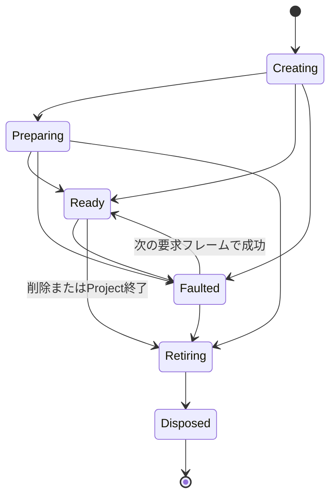

# グラフランタイム

## 状態

確定。グラフ編集、Plan生成、Port値表現、Runtime Node契約、入力解決、Feedback境界およびRuntime Nodeの寿命を定める。

## 目的

- ライブ編集中の不完全なグラフを保持しながら、有効な枝だけを安全に評価する。
- 接続検証と評価順構築をグラフ変更時へ集約し、通常フレームの仕事を小さくする。
- Node実装がProjectDocument、入力Textureまたは共通Poolを勝手に変更できないようにする。
- 不明型、Broken接続、PreparingおよびFaultedを削除やnullで表現しない。

## 保存グラフと実行グラフ

ProjectDocumentの保存グラフとRuntimeSessionの実行グラフを分ける。

| 保存グラフ | 実行グラフ |
|---|---|
| Node Record | Runtime Node Handle |
| Connection Record | Active EdgeまたはBroken Edge |
| NodeTypeIdとSchemaVersion | 解決済みNode Type Definition |
| BaseValue | FrameSnapshot内のEffectiveValue |
| UnknownNodeの生データ | 評価不能Handle |
| 安定IDと表示位置 | インデックス、評価順、結果キャッシュ |

- 保存グラフはユーザー情報と修復情報を失わないことを優先する。
- 実行グラフは現在のカタログで安全に評価できる部分だけを高速に参照できる形へ変換する。
- Broken ConnectionとUnknownNodeは保存グラフに残すが、Active Edgeまたは実行可能NodeとしてPlanへ含めない。

## Graph Revision

- 保存グラフの構造が変化するたびにGraph Revisionを単調増加させる。
- ノード位置、表示名、折り畳みなど評価へ影響しない変更ではGraph Revisionを増やさない。
- Node追加・削除、Enabled、接続、Node TypeまたはPort構造へ影響する復旧でGraph Revisionを増やす。
- `EvaluationPlan.SourceRevision` と現在のGraph Revisionが一致する場合だけPlanを使用する。
- ParameterのBaseValue変更だけではPlanを再構築しない。

## GraphEditCommand

### 共通契約

GraphEditCommandは次を持つ。

- `CommandRequestId`: UIのPending表示と結果通知に使うセッション内ID
- Command種別
- 対象NodeInstanceId、PortId、ConnectionIdなどの安定ID
- 要求時Document Revision
- Command固有Payload

要求時Revisionは競合診断に使用するが、単に古いだけでは拒否しない。適用時のProjectDocumentへ再検証し、安全に意味を保てる場合は適用する。

### Command種別

- Add Node
- Delete Nodes
- Restore Nodes
- Connect
- Disconnect
- Replace Input Connection
- Set Enabled
- Restore UnknownNode
- Undo
- Redo

ノード位置、選択、折り畳みなど評価構造を変えない編集はProjectEditCommandとし、GraphEditCommandから分ける。

### 検証順序

1. Command Payloadの構文とID形式
2. 対象の存在または期待する不存在
3. SystemOwned、削除不可、複製不可などの権限
4. ノード数、Scene Layer数、接続数などの上限
5. Portの存在、方向、Required／Optionalおよび単一入力規則
6. Port型の完全一致または既定暗黙変換
7. 選択したConversion IDの存在と型対応
8. 置換後グラフでのFeedbackを除く同一フレーム循環
9. EvaluationPlanが要求するActive Edgeとシステムノードの不変条件

検証はGraph Batch Workspace上の変更候補へ行い、バッチのPlan構築が成功するまで現在グラフを変更しない。入力接続置換では旧EdgeをWorkspace上だけで除外して新Edgeを検証し、成功後に1つのPatchとして置換する。

### 適用結果

- 成功候補は `GraphPatch` としてWorkspaceへ適用し、バッチのPlan構築成功後にProjectDocumentへ確定する。
- GraphPatchはUndoに必要な変更前後の最小レコードを持つ。
- Undo／Redoも同じPatch適用経路を使い、中間状態を公開しない。
- Undo履歴は200件とし、ProjectDocumentではなくRuntimeSessionの編集履歴が所有する。
- 失敗時はDiagnosticCodeとユーザー向け理由を返し、ProjectDocument、State Token、Graph RevisionおよびUndo履歴を変更しない。

## Node Type Registry

- 起動時にNodeTypeCatalogから不変の `NodeTypeRegistry` を作る。
- RegistryはNodeTypeIdによる完全一致検索だけを実行経路へ提供する。
- 表示名、カテゴリ、Favorites検索はPresentation用Read Modelで扱い、実行検索へ混ぜない。
- Registry構築時にNodeTypeId、PortId、ParameterId、ConversionおよびFactory参照を検証する。
- Registry検証失敗はアプリケーション起動診断とし、VJプロジェクトを開かない。
- 実行中にRegistryへ追加・削除しない。

## EvaluationPlan

EvaluationPlanはGraph Revisionごとに作る不変オブジェクトとする。

### 内容

- NodeInstanceIdと密なRuntime Indexの対応
- Active Edgeの送信元・送信先Index
- 入力Portごとの接続または未接続状態
- EdgeごとのConversion ID
- Feedbackで切断した同一フレーム依存
- 安定したトポロジカル順序
- Program Output Index
- Preview Node Index一覧
- 各出力から上流へたどるための逆方向隣接情報
- Nodeごとの固定Port定義とParameter参照表

### 安定順序

複数の正しい評価順がある場合は次の順で一意にする。

1. Programから必要な枝
2. フォーカス中Previewからだけ必要な枝
3. その他Previewからだけ必要な枝
4. 同じ優先度ではNodeInstanceIdの昇順

優先度は毎フレームのDemandで変化するため、Plan自体は依存を満たす基本トポロジカル順位と安定IDを保持し、Demand PlannerがProgram／Preview優先の実行リストを作る。

### Plan生成失敗

- Feedbackを除去しても循環が残る場合は原因Edgeを返す。
- ProgramOutputが欠落または重複する保存データは読込修復を先に行う。
- Active Edgeの端点または型が不正なら、そのEdgeを暗黙削除せずBrokenとして再分類して再構築する。
- 内部不変条件の破損でPlanを作れない場合は候補変更を拒否し、直前Planを維持する。

## Demand Planner

毎フレーム、EvaluationPlanと出力Targetから `FrameDemand` を作る。

### Demand

各要求は次を持つ。

- Output Target種別と安定優先順位
- Node Runtime IndexとOutput Port Index
- 要求幅・高さ
- 要求アスペクト比
- Previewの場合は品質段階とフォーカス時刻

### 逆引き

- TargetからActive Edgeを上流へたどる。
- 同じNode Outputへ届くDemandを1つへ統合する。
- 採用アスペクト比はProgram、フォーカス中Preview、その他Previewの順で決める。
- 採用アスペクト比を保ち、全要求の幅と高さ以上になる最小整数サイズを求める。
- 同じNodeの複数Outputが要求された場合はRequested Output Setへまとめる。
- ProgramとPreviewで共有したNodeを複数回追加しない。

### Feedback

Feedbackの `image` 出力から `input` Edgeへは、同一フレームの依存を張らない。

- Feedback出力を前フレーム履歴を返すSourceとして扱う。
- Feedback出力がDemandへ入った場合だけ、そのInput上流をFeedback Commit用の追加Targetとして逆引きする。
- Commit TargetからFeedback出力へ戻るEdgeは時間境界で切れているため、Plan全体はDAGのままになる。
- Phase 6で入力枝まで評価し、Phase 7で履歴をCommitする。
- Demandへ入らないFeedbackは出力も入力枝も評価せず、履歴を維持する。

## Port値表現

### PortValue

初期Port型を表す読み取り専用の判別可能値とする。

- ImageFrame
- Float32
- Int32
- Bool
- Vector2f
- Vector3f
- Vector4f
- ColorLinear

実行グラフ内で `object`、nullまたは文字列型名による値判定を使わない。PortTypeIdと実値種別の一致をRegistry構築時、接続時およびRuntime Node出力時に検証する。

### NodeOutputResult

出力Portごとに次のいずれかを持つ。

- `Available(PortValue)`
- `Blocked(Diagnostic)`
- `Faulted(Diagnostic)`
- `Preparing(Diagnostic)`

Available以外にダミーPortValueを持たせない。ImageFrameは仕様どおり有効なRenderTextureだけを保持する。

### Edge変換

- Port型が完全一致する場合はPortValueを読み取り専用で共有する。
- 暗黙変換があるEdgeだけ、保存されたConversion IDのConverterを1回適用する。
- Converterは入力を変更せず、新しい値型PortValueを返す。
- 変換欠落はBroken Edge、変換失敗はConversionFaultとする。
- どちらもRequired入力をBlocked、Optional入力をUsingFallbackへ導く。
- 代替Converterを自動選択しない。

## Runtime Node契約

### IRuntimeNode

Runtime Nodeは次の責務だけを持つ。

- 検証済みNode初期状態からノード固有の実行状態を構築する。
- FrameSnapshotと解決済み入力を参照する。
- Requested Output Setに含まれる出力だけを生成する。
- 借用した出力Surfaceへ書き込み、NodeOutputResultを返す。
- ノード固有の非同期準備を開始し、完了まではPreparingを返す。
- 破棄要求後に自身が所有するMaterial、Prefab Instance、Video Backendなどを解放する。

Runtime Nodeは次を行わない。

- ProjectDocumentまたはBaseValueの変更
- 入力PortValueまたは入力RenderTextureへの書込み
- 共通RenderTextureの生成、破棄またはLease返却
- NodeTypeRegistry、Scene Layer Poolまたはグローバルサービスの探索
- Unity Timeの直接参照
- `Evaluate` 内での待機、Task完了待ちまたは同期ファイルI/O

### NodeExecutionContext

巨大なService Locatorにせず、評価に必要なフレーム限定情報をまとめる。

- FrameSnapshot
- NodeInstanceIdとNode Runtime Index
- Requested Output Set
- OutputごとのResolution Demandと借用Surface
- 解決済みInput Set
- ノード診断を書き込む限定Sink

Scene生成、動画準備およびTexture Lease取得はNodeExecutionContextから任意サービスを検索させず、Factory生成時に用途別Portを明示注入する。

### 評価結果

- `Evaluate` は要求出力ごとのNodeOutputResultを `NodeOutputWriter` へ必ず設定する。
- 設定されなかった要求出力はRuntime契約違反としてFaultedへ変換する。
- 定義されていないOutputへの書込みは拒否する。
- AvailableなImageFrameのSize、GraphicsFormat、FrameNumberおよびLeaseIdを借用Surfaceと照合する。
- 同じRuntime Nodeを同一FrameNumberで2回Evaluateしようとした場合はCoordinatorの不変条件違反として拒否する。

## 入力解決

各NodeをEvaluateする直前に、固定Port定義と当該フレームの上流結果からInput Setを作る。

### グローバルインスタントエフェクト入力

- `Instant Effect Triggers` は16個のBool出力を持つInputノードとする。各出力のキーボード入力はMain HostのInspectorで任意に割り当て、未割り当ての出力は画面上の枠から操作する。
- キー押下は対応する出力を1評価フレームだけtrueにし、押し続けても再発火しない。
- 入力ノード自身はFXを定義または起動しない。FXノードのTrigger入力へグラフ上で配線された出力だけが発火する。
- 未配線の出力は何も変更しない。パッチのロード、選択または切替へ変換しない。

### Required

- 未接続、Broken Edge、上流Blocked、Faulted、PreparingまたはConversionFaultのいずれでも入力不可とする。
- Node自身をBlockedとし、Evaluateを呼ばない。
- Blocked理由にInput Port、直接原因Nodeおよび根本Diagnosticへの参照を含める。

### Optional

- 正常なAvailable値を取得できればその値を使う。
- 取得できなければPort定義のDefaultまたは対応ParameterのEffectiveValueを使う。
- ImageFrame Defaultはシステム共有の読み取り専用Frameを要求解像度と内部形式で取得する。
- Input状態をUsingFallbackとするが、Nodeの出力は通常どおりAvailableになれる。
- 同じ原因が継続しても通常診断履歴へ毎フレーム追加しない。

## Runtime Nodeの寿命

- Node追加確定後、FactoryがRuntime Node Handleを作る。
- Unityリソース生成が即時完了しない場合はPreparingとする。
- Faulted Nodeも要求されている次フレームに再試行できる状態を維持する。
- Node削除時はPhase 1でRetiringへ移し、そのフレームのPlanから除外する。
- Phase 9で出力Lease返却、Camera停止、Scene Unload、Backend破棄を開始する。
- 非同期破棄完了後にLayerなどの貸出資源を返し、Disposedへ移す。
- 古いCompletionはGeneration IDが一致しなければHandleへ適用しない。

## Generation ID

NodeInstanceIdがUndoで復元される場合、削除前の非同期Completionを新しいRuntime Nodeへ誤適用しないため、Runtime Handleごとにセッション内単調増加のGeneration IDを持つ。

- CompletionはNodeInstanceIdとGeneration IDの両方を持つ。
- 現在Handleと一致しないCompletionは破棄する。
- Generation IDは実行時だけで使用し、project.jsonへ保存しない。
