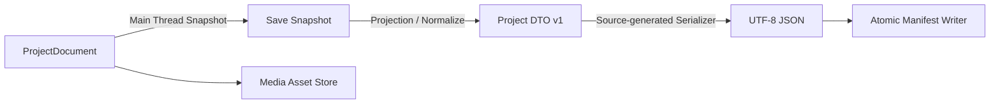
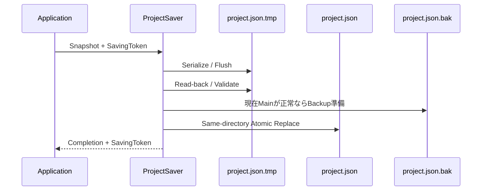

# 永続化アーキテクチャ

## 状態

確定。JSON Serializer、DTO、安定出力、原子的保存、読込、Project／Node移行、UnknownNode、素材操作、Save Asおよびユーザー設定の境界を定義する。

## 目的

- 保存途中の終了またはI/O失敗で、最後の正常なproject.jsonを失わない。
- 未知Node型、新しいNode Schema、Broken参照および不明なNode固有状態を削除しない。
- Project Folderだけを別PCへ移動して、素材を含めて開けるようにする。
- JSONを人間が読め、同じProject状態から安定した差分を生成できるようにする。
- 読込不能Projectが現在実行中のProjectを壊さないようにする。
- Unity Object、RuntimeSessionおよびBackground Taskを保存モデルへ混在させない。

## Serializer

Unity 6000.5.9f1のTargeting Packに含まれる `System.Text.Json` を使用する。追加のJSON Packageは導入しない。

- DTOはSource Generation対応の `JsonSerializerContext` へ明示登録する。
- IL2CPP PlayerでRuntime Reflectionによる型探索へ依存しない。
- Project DTOへUnity Object型を含めない。
- UUID、安定ID、Parameter Value、Raw Node Stateへ明示Converterを用意する。
- `JsonUtility` はproject.jsonの読書きに使用しない。
- Newtonsoft.Jsonは追加しない。

### Parser設定

- UTF-8を厳密に検証する。
- BOMは読込時に許容するが、保存時は付けない。
- JSON CommentとTrailing Commaを許可しない。
- 最大Depthは64とする。
- 同じObject内の重複Propertyを事前走査で拒否する。
- ProjectFormatVersion 1で定義されていないPropertyは、明示的なRaw Payload内を除いて拒否する。
- NaN、Positive／Negative Infinityを許可しない。
- 大文字小文字を無視したProperty照合を行わない。
- project.jsonの最大Byte数は初期版で64MiBとし、超過時は開かない。

64MiB上限は素材本体へ適用しない。上限変更は実Projectの計測とMigration方針を伴う仕様変更として扱う。

## 永続化レイヤー



### ProjectSerializer

DTOとUTF-8 JSONの相互変換だけを所有する。File Path、`.bak`、Project切り替えまたはDirtyを扱わない。

### ProjectValidator

DTOのID、型、上限、参照およびProjectFormatVersionを検証し、Fatal、Repair、Brokenへ分類する。

### MigrationCoordinator

Project Format MigrationとNode Schema Migrationを順番に適用し、事前BackupとDirty理由を管理する。

### ProjectLoader／ProjectSaver

Application Use Caseとして、Serializer、Validator、Migration、File WriterおよびState Tokenを調停する。

### MediaAssetStore

素材コピー、Hash、Probe、相対Path、削除および読込時整合性確認を所有する。

### IProjectFileSystem

実File I/Oを抽象化し、通常実装とFault注入Test実装を分ける。汎用Repositoryまたは仮想File System Frameworkは作らず、Project永続化に必要な操作だけを公開する。

## Project Folder

```text
ProjectName/
├─ project.json
├─ project.json.bak
├─ project.json.tmp
├─ Assets/
│  └─ {MediaAssetId}/
│     └─ source.ext
└─ Backups/
```

- `project.json.bak` と `project.json.tmp` は必要な場合だけ存在する。
- Source fileの元絶対PathをProject内へ保存しない。
- Temporary Import fileは対象MediaAssetId Folder内に置き、確定前はCatalogへ追加しない。
- Persistenceは上記既知Entry以外を自動削除しない。

## Project DTO v1

Top Levelを次へ固定する。

```json
{
  "projectFormatVersion": 1,
  "projectName": "Example",
  "settings": {},
  "graph": {
    "nodes": [],
    "connections": []
  },
  "logicalControls": [],
  "controlMappings": [],
  "presets": [],
  "mediaAssets": [],
  "ui": {}
}
```

### settings

- HDR／LDR内部形式
- Program Display選択
- Projectに属する出力設定

ユーザー共通のUI Scale、Theme、Tooltip、Recent ProjectおよびLayout Presetを含めない。

### graph.nodes

各Nodeを次の領域へ分ける。

- NodeInstanceId
- NodeTypeId
- SchemaVersion
- Display Name、Enabled、Positionなどの共通状態
- BaseValue一覧
- 保存時Port Snapshot
- Node固有 `state` Raw JSON Object

BaseValueはParameterIdと判別可能なParameter Valueの組にする。Dictionaryとして直接保存せず、ParameterId順へ整列した配列を使う。

### graph.connections

- ConnectionId
- Source NodeInstanceIdとPortId
- Destination NodeInstanceIdとPortId
- ConversionIdのOptional値

接続はSource Node、Source Port、Destination Node、Destination Port、ConnectionIdの順で正規化する。

### Port Snapshot

現在は既知Nodeでも、将来NodeTypeが欠落したときにUnknownNodeのSocketを復元できるよう、全Nodeへ保存時Port Snapshotを持たせる。

- PortId
- Direction
- PortTypeId
- Required／Optional
- ImageFrame Optional入力のDefaultImage

既知Nodeを開く場合はCatalog定義を実行時の正とし、Snapshotとの差をSchema不一致として検証する。未知NodeではSnapshotを表示と接続保持に使用する。

### Parameter Value

JSONの数値や文字列だけから型を推測せず、型Tagを保存する。

```json
{
  "parameterId": "mix.amount",
  "value": {
    "type": "float",
    "value": 0.5
  }
}
```

- Float、Int、Bool、Vector2、Vector3、Vector4、Color、String、Enum、MediaAssetReferenceを明示する。
- VectorとColorの成分名を固定する。
- EnumはC# Enum名ではなく安定Option IDを保存する。
- MediaAssetReferenceはMediaAssetIdを保存し、未選択だけ明示nullを許可する。
- FloatはRound-trip可能な有限値としてInvariant Cultureで出力する。

### Node固有state

Node固有stateはNodeTypeIdとSchemaVersionが所有するJSON Objectとし、Persistenceは意味を解釈しない。

- Known Nodeは対応Node State Codecが型付き状態とRaw JSONを変換する。
- UnknownNodeはRaw JSONをUTF-8 Byte列の `RawJsonValue` として保持する。
- RawJsonValueは読込時に単独の有効なJSON Objectであることを検証し、project.json全体の64MiB上限へ含める。初期版ではNode stateだけの追加Size上限を設けない。
- UnknownNodeを再保存するときはRawJsonValueを再解釈・正規化せず、そのまま `state` 値として書く。
- Migration成功後のstateは新VersionのCodecでCanonical出力する。

UnknownNodeのRaw state内だけは、外部所有データを失わないためProperty順と空白を正規化しない。

Known NodeのNodeTypeIdとSchemaVersionが現在Catalogと一致するのにPort Snapshotが異なる場合は、公開後Schemaを変更したCatalog契約違反として扱う。接続をCatalogへ強制適合させず、そのNodeをUnknownNodeへ隔離して元Snapshotと状態を保持する。

## UnknownNodeの保存表現

ProjectDocumentでは `system.unknown_node` のPlaceholderとして扱うが、project.jsonでは元のNodeTypeIdとSchemaVersionを保つ。

- Original NodeTypeId
- Original SchemaVersion
- RawJsonValue
- Port Snapshot
- BaseValueと共通状態
- Node位置
- 関連Connection

`system.unknown_node` を元NodeTypeIdへ上書きして保存しない。これにより、対応NodeTypeが将来復帰した読込時に自動Migrationと復元を試せる。

Port Snapshotがない旧Dataでは、Connection端点から型不明・接続不可のStub PortをProjectDocument構築時に補う。補ったProjectはDirtyにする。

## Canonical出力

同じSave Snapshotから同じUTF-8 Byte列を生成する。

- Property順はDTO v1で固定する。
- NodesはNodeInstanceId順。
- Connectionsは端点とConnectionId順。
- BaseValuesはParameterId順。
- Logical Controls、Presets、Media Assets、Dashboard Pageは各安定ID順。
- 意味を持つUser順序は別の明示 `order` またはID配列で保存し、Serializerの配列順へ暗黙依存しない。
- 改行はLF、Indentは2 Spaces、File末尾に1つの改行を付ける。
- UTF-8 BOMを付けない。
- Optional PropertyはSchemaで省略可と定義したものだけ省略し、既定値の表現をCodecごとに変えない。
- Dictionaryの列挙順を利用しない。

UnknownNode Raw stateはOpaque Payloadなので、内部Property順と空白のCanonical化対象外とする。

## 保存Snapshot

Save要求時にメインスレッドで不変Snapshotを作る。

- ProjectDocumentの全保存対象
- Current State Tokenを `SavingToken` として取得
- RuntimeStateful Parameterの現在EffectiveValue
- 保存時点のVideo Playhead
- Project Dirty理由

RuntimeStateful ParameterはSave Snapshot上だけでEffectiveValueを次回BaseValueへ投影し、ProjectDocumentへ毎Frame書き戻さない。この投影自体でDocument RevisionまたはDirtyを変更しない。

Snapshot完成後のSerialize、File WriteおよびRead-back検証はBackground Taskで実行できる。SnapshotへUnity Object、Runtime Nodeまたは可変Collectionを含めない。

## 原子的保存

同一ProjectへのSaveはSingle-flightとし、実行中は同じProjectへのSave要求を無効化する。映像評価と編集は継続する。



### 手順

1. 既存project.json.tmpがあれば、前回失敗の診断対象として記録した後、新しい試行で上書きする。
2. Snapshotをproject.json.tmpへ完全にSerializeする。
3. File内容をOSへFlushしてHandleを閉じる。
4. tmpを同じLoader設定で読戻し、構文、Version、ID、参照およびCanonical変換可能性を検証する。
5. 現在のproject.jsonが正常な場合だけ、それをproject.json.bakとして1世代保持する。
6. tmpを同一Directory内でproject.jsonへ原子的に置換する。
7. Completion Queueへ成功とSavingTokenを返す。
8. メインスレッドで `SavedToken = SavingToken` とする。

保存中に編集され `CurrentToken != SavingToken` なら、File保存成功後もProject Dirtyを維持する。

### Platform Adapter

`IAtomicManifestWriter` をWindowsとmacOSのPlatform Integration Testで検証する。

- Windowsは同一VolumeのReplace機能で、旧MainのBackupとtmp置換を1操作として行う。
- macOSは現在Mainの検証済みCopyを一時BackupへFlushし、Backupを原子的に確定してから、POSIX同一Directory RenameでtmpをMainへ置換する。
- Mainが存在しない初回保存は、同一Directoryのtmpを最終名へRenameする。
- Recovered状態でMainが破損している場合は、破損Mainを正常な `.bak` の置換元に使わず、既存の正常Backupを維持する。
- 原子的置換を保証できないFile Systemでは非原子的な上書きへFallbackせず、保存を失敗させる。

### 失敗

- tmp書込み、Flush、読戻し、BackupまたはReplaceのどこで失敗してもSavedTokenを変更しない。
- Replace前の失敗では既存MainとBakを変更しない。
- Replace成功後にCompletion適用が遅れても、Fileは正常保存済みとして扱う。
- 失敗したtmpは次のSave試行または明示Cleanupまで残し、DiagnosticsへPathと失敗段階を記録する。
- Project切り替え、CloseまたはExitでSaveを選んだ場合は、Save Completionを確認してから切り替える。

## 読込Pipeline

現在Projectを維持したまま候補を検証する。

### Stage 1: Fileと構文

- 選択PathをProject Rootとproject.jsonへ正規化する。
- File Size、厳密UTF-8、JSON構文、重複Property、Depthを検証する。
- ProjectFormatVersionと必須Top Level Propertyを確認する。
- 主FileがFatalならproject.json.bakを同じ手順で検証する。
- project.json.tmpを自動採用しない。存在だけを診断する。

### Stage 2: VersionとMigration

- 現在より新しいProjectFormatVersionはProject全体を開かない。
- 古いProjectFormatVersionは連続Project Migratorがすべて存在する場合だけ移行する。
- Node Schema Migrationの前に元project.json Byte列をBackupsへ保存する。
- Project Format Migrationを先に、Node Schema Migrationを後に実行する。
- Migrationはメモリ上のCopyへだけ適用する。

### Stage 3: Domain検証

- UUID、安定ID、有限値、文字列長、ID一意性を検証する。
- SystemOwned Node、ProgramOutput、Connection上限およびGraph不変条件を検証・修復する。
- CatalogにないNode、新しいSchemaまたはNode Migration失敗をUnknownNodeへ変換する。
- 欠落Node、Parameter、Preset、MediaおよびConversion参照をBrokenとして保持する。
- Hard Range外の旧BaseValueをClampし、警告とDirty理由を追加する。

### Stage 4: 素材整合性

- 相対Pathの形式とProject Root内包含を検証する。
- File存在とByte Sizeを先に確認する。
- Size一致時だけXXH3-128を計算する。
- 欠落またはHash不一致をMedia Faultとして候補Projectへ記録する。
- 素材障害だけではProject全体を拒否せず、参照NodeをFaultedにできる状態で開く。

### Stage 5: Candidate Commit

- Resource未取得のCandidate ProjectDocumentとRuntimeSession構造を作る。
- FatalがなければStateModelのCommit順でCurrent Projectを切り替える。
- `.bak` 使用時はRecovered、Migration／Repair／Clamp時はMigratedまたはRepairedとしてDirtyにする。
- 自動保存しない。

## Fatal、Repair、Broken

| 分類 | 例 | 結果 |
|---|---|---|
| Fatal | JSON不正、Project Version未対応、重複Node ID、必須Root欠落 | Candidateを開かない |
| Repair | ProgramOutput欠落／重複、旧値Clamp、Port Stub補完 | 開く、警告、Dirty |
| Broken | UnknownNode、欠落Media、欠落Preset、欠落Conversion | 情報を保持して開く |

曖昧な重複IDを自動再発行しない。別IDへ変えるとConnectionやPresetの参照先を安全に決められないためFatalとする。

## `.bak` Recovery

- 主FileがFatalで `.bak` が有効な場合だけBackupを候補として使う。
- 主Fileが有効で素材だけが欠落している場合は `.bak` へ戻らない。
- Recovered Projectは新しいCurrent State Tokenを持ち、SavedTokenと一致させない。
- `Recovered from backup` Bannerを表示する。
- 主要操作をSave As、副操作を明示的なOverwrite Mainとする。
- 主Fileを自動修復または上書きしない。
- 主とBakの両方がFatalならCurrent Projectを維持する。

## Migration

### Project Format

- `IProjectFormatMigrator` はvNからvN+1だけを変換する。
- Versionを飛び越すMigratorを登録しない。
- 全体DTOのCopyを入力し、新しいCopyまたはFailureを返す。
- 途中失敗ではCandidate全体を破棄し、Current Projectを維持する。

### Node Schema

- `INodeStateMigrator` はNodeTypeId、FromVersion、ToVersionで一意に登録する。
- 対象NodeのRaw state CopyへvNからvN+1を順番に適用する。
- 失敗したNodeだけをUnknownNodeとし、元RawJsonValueを保持する。
- 成功Nodeは最新SchemaVersionとCanonical stateへ更新する。
- 別NodeTypeのMigrationへFallbackしない。

### Backup

- ProjectまたはNode Migrationで状態が変わる前に、元Manifest Byte列をBackupsへ保存する。
- File名はUTC Timestamp、元ProjectFormatVersionおよび内容Digestを含む衝突しない形式にする。
- Backup FileをFlushし読戻し確認してからMigrationを続ける。
- Backup作成失敗ではMigrationを開始せず、Candidateを開かない。
- 最新5世代を保持し、6世代目以降は新Backup確定後に古い順で削除する。
- 世代整理失敗は警告とし、新BackupとMigration結果を失敗扱いにしない。

## Media Import

1つの素材Importを独立Transactionとして扱う。

1. UUID v4のMediaAssetIdを生成する。
2. `Assets/{MediaAssetId}` を作り、`source.ext.importing` へStream Copyする。
3. Copy元と一時CopyのByte SizeとXXH3-128を計算して一致を確認する。
4. 一時Copyに対してCodec／Image Probeを行う。
5. FileをFlushし、同じDirectoryで `source.ext` へRenameする。
6. Media MetadataをProjectEditCommandとしてCurrent Projectへ追加する。
7. Command確定後にだけ素材をCatalogとNode Pickerへ公開する。

- Copy、Hash、ProbeはBackgroundで進め、UIへ進捗をCompletion経由で返す。
- 同じ内容でも毎回新しいMediaAssetIdを作る。
- Project切り替えまたはCancel時は未確定Importを中止し、一時DirectoryをCleanupする。
- ProjectEditCommandが拒否された場合は確定済みFileも削除し、Catalogへ残さない。
- 元絶対Pathは処理中だけ保持し、ProjectDocument、Diagnostic Exportまたはproject.jsonへ保存しない。

## Media Delete

- Applicationは削除前に参照NodeとPresetを列挙し、明示確認を要求する。
- 確認後、ProjectEditCommandでMedia Catalog Entryを削除し、対象Asset DirectoryをPending DeletionとしてSessionに記録する。
- NodeとPreset内のMediaAssetId参照は削除せずBrokenとして残す。
- ProjectEditCommand確定直後にはAsset Directoryを削除しない。最後に保存済みのproject.jsonがまだ素材を参照している可能性があるためである。
- 対象MediaAssetIdを含まないSave Snapshotが正常にproject.jsonへ確定し、Current Projectにも同じMediaAssetIdが復元されていないことを確認してからAsset Directoryを削除する。
- UndoでMedia Catalog Entryが復元された場合はPending Deletionを取り消す。
- Save AsではSource ProjectのFileを削除せず、Targetへ不要AssetをCopyしない。Current Root切り替え後にSource側のPending Deletionを実行しない。
- Directory削除失敗ではCatalog削除を巻き戻さず、未参照Orphanとして診断する。
- Orphanを自動的に別MediaAssetへ関連付けない。
- Orphan Cleanupは参照がないことを再検証する明示操作だけで行う。

Catalog参照が消えた後にFileが残る方を、Fileだけ消えて有効Catalog参照が残る状態より安全な失敗とする。

## Save AsとNew Project

### New Project

- Userが選んだParent Folder内に、最終Project名と衝突しないStaging Directoryを作る。
- ProgramOutputとMain Dashboardを含む初期ProjectをStagingへ保存・読戻し検証する。
- AssetsとBackups Directoryを作る。
- Targetが存在しないことを再確認し、Staging Directoryを同じParent内で最終名へRenameする。
- 成功後にだけ新ProjectをCurrentへ切り替える。

### Save As

- Target Parent内のStaging Directoryへ全Catalog AssetをStream Copyする。
- Copy後にSizeとXXH3-128を検証する。
- 新しいSave SnapshotをStagingのproject.jsonへ保存・読戻し検証する。
- Targetが存在しない、またはUserが明示した空Directoryである場合だけ最終化する。
- StagingをTargetへRenameしてからCurrent Project Rootを切り替える。
- 失敗時は元ProjectとCurrent Rootを維持する。

SourceとTargetが別Volumeでも、StagingをTarget Parentに作るため、最終Renameは同じFile System内で行う。

## Path安全性

- 保存PathはProject Rootからの相対Pathへ統一し、Separatorを `/` で保存する。
- 読込時に `Path.GetFullPath` 相当で正規化し、Project Root外へ出るPathを拒否する。
- Rooted Path、空Segment、`.`、`..`、NULおよびPlatform不正文字を拒否する。
- Media Pathは `Assets/{MediaAssetId}/source.ext` の形とMediaAssetId Folder一致を検証する。
- Project管理下のAsset EntryがSymbolic LinkまたはReparse Pointの場合は初期版で拒否する。
- User入力文字列を結合したままDelete、MoveまたはReplaceへ渡さない。
- Project Root自体がUserの選んだLink先である場合は、解決済みRootを基準に包含を判定する。

## User SettingsとLayout

Project永続化と別Storeにする。

```text
Application.persistentDataPath/ShitDesigner/
├─ settings.json
└─ layouts.json
```

### settings.json

- UI Scale
- ThemeとReduce Motion
- Tooltip Delay
- Media LibraryのGrid／List表示方式
- Diagnostics Export初期Folder
- Recent Project最大10件

### layouts.json

- Layout Preset ID、名前
- Panel種別、配置、Size、表示、Tab構成
- Current Layout ID

- それぞれ独立FormatVersion、DirtyおよびAtomic Writerを持つ。
- ProjectDocument、Dashboard内容、Preview対象またはNode位置を含めない。
- Layout保存失敗でProject Dirtyを変更しない。
- Unknown PanelはRaw Payloadを保持する。
- Project SaveとUser Settings Saveを1つのTransactionへ結合しない。

## Autosave

初期版では定期Autosaveを実装しない。保存はUser操作、Saveを選択したClose／Open／New／Exit、および明示的なLayout Saveだけで実行する。

## 診断

永続化Diagnosticへ次を含める。

- Operation IDとStage
- Project RootまたはProject相対Path
- ProjectFormatVersionとNode SchemaVersion
- SavingTokenまたはCandidate ID
- OS Error Code、Exception型、Message、Stack
- Backup、Recovered、Migrated、Repairedの状態
- MediaAssetId、Size、Hash AlgorithmとDigest不一致

元素材の絶対Pathは通常のDiagnostic Exportへ含めない。
