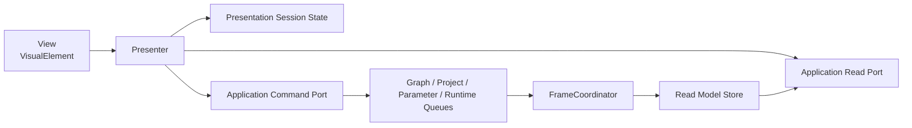

# Presentationアーキテクチャ

## 状態

確定。Runtime UI Toolkit、Read Model、Command、UI状態、Dock Workspace、Node Graph、Parameter UI、映像Surface、入力および通知の実装境界を定義する。

## 目的

- GUIからProjectDocument、Runtime Node、Unity ResourceまたはFileを直接変更しない。
- Project保存状態、実行時状態、User Workspace、Presentation SessionおよびPending要求を混在させない。
- UI操作をフレーム境界へ安全に渡し、適用前の状態を確定済みとして表示しない。
- Program評価と出力を、Panelの表示状態またはGUI障害から独立させる。
- Node型が増えてもParameter Metadataだけで最低限の操作画面を生成できるようにする。
- 画面外Control、非表示Panelおよび変化していないVisual Treeの更新を避ける。

## 採用技術

- Standalone GUIはRuntime UI Toolkitだけで構築する。
- Application ShellごとにRoot `UIDocument` と `PanelSettings` を1組持つ。
- Shell、Panel枠および固定構造はUXML、ThemeとDesign TokenはUSSで定義する。
- Node、Port、Parameter Row、Dashboard WidgetなどData件数で増減する要素はFactoryで生成する。
- uGUI、IMGUIおよびEditor専用の `UnityEditor.Experimental.GraphView` は使用しない。
- Runtime ReflectionによるPanelまたはCustom UI探索を行わず、明示Catalogを使用する。
- ViewごとのMonoBehaviourを作らず、Root HostとPlatform AdapterだけをBootstrapから駆動する。

Node GraphとDock WorkspaceはRuntime向けの必要機能だけを持つ独自実装とする。Editor用Graph Frameworkまたは汎用Window Managerを移植しない。

## 依存境界

`ShitDesigner.Presentation` は `ShitDesigner.Core` と `ShitDesigner.Application` だけを直接参照する。



- PresentationはProject、Graph、Runtime、Rendering、Nodes、MediaおよびPersistenceの内部型を参照しない。
- Project変更はApplication Command Portへ要求する。
- 表示はApplication Read Portの不変Snapshotから行う。
- Node Factory、RenderTexture Pool、Diagnostic HubおよびProject File SystemをPresentationへ公開しない。
- PlatformのPath選択とOS File DropだけはPresentation所有の狭いAdapterを経由する。選択PathをProjectまたは素材として検証・使用するのはApplicationとPersistenceである。

## 構成要素

### PresentationRoot

Root `UIDocument`、Top Bar、Dock Workspace、Status Bar、Modal Layer、Popover Layer、Drag LayerおよびToast Layerを所有する。

- Root Visual Treeの構築はApplication Lifetime中に1回だけ行う。
- Project切り替えではRootを作り直さず、Project ScopeのPresenterを再Bindする。
- UI Scale変更時はPanelSettingsのScaleとDesign Tokenを一括更新する。
- Root以下の例外を捕捉し、可能な場合は該当PanelだけをError Placeholderへ置き換える。

### PresentationCoordinator

Read Model更新、Presenter更新順、Project Scope切り替えおよびBinding破棄を調停する。

- Bootstrapは `FrameCoordinator.Tick()` 完了後に `ApplyLatestReadModels()` を最大1回呼ぶ。
- Phase 9で公開されたSnapshotまたはChange Setだけを消費する。
- 1フレーム中の途中状態をViewへ配信しない。
- Project Session変更を最初に処理し、次にShell、Workspace、各Panel、Notificationの順で更新する。
- Visual Tree変更はメインスレッドだけで行う。

### View

VisualElement構造、表示Style、入力Eventの受取りだけを所有する。

- Domain IDまたは内部Objectを可変状態として所有しない。
- Project変更を直接行わない。
- Event CallbackはPresenterの `BindingScope` へ登録し、Unbind時に必ず解除する。
- Poolへ戻す要素はClass、Inline Style、Tooltip、Focus、Pointer CaptureおよびCallbackを初期状態へ戻す。

### Presenter

Read ModelをViewへ投影し、View EventをCommandまたはSession操作へ変換する。

- Viewへ可変Domain Collectionを渡さない。
- 同じRead Model Versionを二重適用しない。
- 変更されたKeyだけを更新し、Panel全体の再構築を通常経路にしない。
- 非表示Panelは高頻度Bindingを解除し、再表示時にFull Snapshotから復元する。

### Catalog

次の不変CatalogをApplication起動時に明示登録する。

- `PanelCatalog`: PanelTypeId、単一Instance ID、Factory、最小Size
- `NodeCustomUiCatalog`: NodeTypeId、Custom UI Factory
- `ParameterControlCatalog`: Parameter Value Type、標準Control Factory
- `CommandPaletteCatalog`: Command ID、表示名、Shortcut、実行可否Provider
- `IconCatalog`: 意味ID、Vector Image、Accessible Name

登録重複または必須Factory欠落は起動診断とする。Custom Node UIだけは個別生成失敗を標準Parameter UIへFallbackできる。

## 状態所有

| 状態 | 正本 | 保存先 | 例 |
|---|---|---|---|
| Project UI State | ProjectDocument | project.json | Node位置、折り畳み、Dashboard Page／Widget、Preview Tab割当と順序 |
| Runtime Read State | RuntimeSession由来Read Model | 保存しない | EffectiveValue、Node状態、Program性能、Preview品質 |
| User Settings | User Settings Store | settings.json | UI Scale、Reduce Motion、Tooltip Delay、Media表示方式 |
| Workspace Layout | Layout Store | layouts.json | Split、Tab、Panel表示、Size、Current Layout |
| Presentation Session | PresentationSessionState | 保存しない | 選択、Focus、Scroll、検索、Filter、Arrange、Draft、Drag |
| Request Lifecycle | Application Read ModelとPresenter | 保存しない | Accepted、Pending、Applied、Rejected、Superseded |

- Project DirtyとLayout Dirtyを別の値としてTop Barへ表示する。
- Session状態の変更ではProject DirtyまたはLayout Dirtyを変更しない。
- Layout適用によるPanel表示変更ではProject UI Stateを変更しない。
- Project切り替え時はProject Scopeの選択、Draft、Drag、Pending表示およびFilterを破棄する。User SettingsとLayoutは維持する。
- Node LibraryのRecentとFavoritesは初期版ではApplication Session内だけで保持し、Projectへ保存しない。

## Application Read Model

### Envelope

すべてのRead Model公開単位は次を持つ。

- `ProjectSessionId`: Current Project切り替えごとに変わるApplication Session ID
- `ReadModelVersion`: 公開ごとに単調増加するVersion
- `FrameNumber`: 元になった評価フレーム
- `DocumentRevision`
- `GraphRevision`
- `IsFullSnapshot`

PresentationはProjectSessionIdが異なる更新を混在させない。Versionを飛ばした場合は差分を推測せず、Application Read PortへFull Snapshotを要求する。

### 分割

巨大な1つのViewModelを毎フレーム複製せず、更新特性ごとに分ける。

- `ShellReadModel`: Project名、Project Dirty、保存状態、Undo／Redo可否、GraphClock、性能Summary
- `WorkspaceReadModel`: Current Layout、Layout Dirty、Panel可視状態
- `NodeCatalogReadModel`: UserAddable、表示名、カテゴリ、Port／Parameter Metadata
- `GraphReadModel`: Node、Port、Connection、位置、共通表示状態
- `ParameterReadModel`: BaseValue、EffectiveValue、公開状態、Clamp／Broken、Logical Control状態
- `DashboardReadModel`: Page、Widget、参照状態
- `PresetReadModel`: Preset、適用可否、Broken項目
- `MediaReadModel`: Catalog Metadata、整合性、参照数、Import Task
- `OutputReadModel`: Program、Preview Tab、品質、提示Surface
- `DiagnosticReadModel`: Current、History、Summary
- `CommandResultReadModel`: Pending要求とTerminal Result

各Collectionは安定IDをKeyにした読み取り専用Recordとして公開し、VisualElementまたはUnity Eventを含めない。

### Change Set

- Add、Update、Removeを安定ID単位で公開する。
- 同じIDの複数変更はPhase 9で最終状態へまとめる。
- 並び順に意味がある場合は明示OrderまたはOrder Versionを使う。
- EffectiveValueは値が変わったParameter IDだけを通知する。
- Viewport外、折り畳み中または非表示のParameter PresenterはChangeを適用せず、再表示時に最新値を引く。
- Diagnostics HistoryはEntry ID単位で更新し、Ring Buffer上書きによるRemoveを明示する。

## CommandとPending

### 要求

PresenterからApplicationへ送る要求は次を持つ。

- `ProjectSessionId`
- `CommandRequestId`
- 必要な場合は `InteractionId`
- 対象安定ID
- 要求時Document Revision
- 型付きPayload

`CommandRequestId` はApplicationが発行し、Application実行中に再利用しない。Slider DragやNode Dragなど1つのGestureから生じる連続要求は同じInteractionIdを使用する。

### 受付結果

Command Portは同期的に受付だけを返す。

- `Accepted(CommandRequestId)`: Queueへ入った。適用済みではない。
- `RejectedBeforeEnqueue(DiagnosticCode, Reason)`: 形式不正、対象なし、Queue上限などで受け付けていない。

Accepted後の各要求は、Read Model上で必ず次のいずれかへ到達する。

- `Applied`: フレーム境界またはApplication Transactionで確定した。
- `Rejected`: 適用時の再検証に失敗した。
- `Superseded`: 同じInteractionの新しい連続値へ合流された。
- `Cancelled`: Project切り替えまたは明示Cancelで処理を終了した。

Terminal Resultを発行しないままPendingを削除しない。

### 表示規則

- Accepted時点で対象へPending Styleを付ける。
- Appliedを受けた後、確定Read Modelの値へ置き換えてPendingを外す。
- Rejectedでは確定Read Modelへ戻し、対象InlineまたはPointer付近へ理由を表示する。
- Supersededは古い要求だけを閉じ、同じInteractionの最新要求があればPendingを維持する。
- ProjectSessionIdが変わった要求結果は新Projectへ適用しない。
- File Import、Save、Openなど複数フレームにまたがる操作はStage付きTask Read Modelを使い、Graph編集用の短いPendingと混在させない。

Slider Thumb、Node Drag位置、Selection Rectangle、接続Drag線など、取り消し可能なGesture表示だけはSession Stateで即時更新できる。Projectの確定値、Node存在、Connection存在またはPreset適用成功を先行表示しない。

## Dock Workspace

### Layout Model

Dock構造を次の判別可能なTreeで表す。

```text
DockNode = Split(Axis, Ratio, First, Second)
         | TabGroup(PanelInstanceIds, ActivePanelInstanceId)
         | Empty
```

- PanelInstanceIdは初期版の単一Instance Panelごとに固定する。
- Split Ratioは0より大きく1より小さい有限値とし、実描画時に子Panelの最小SizeでClampする。
- 同じPanelInstanceIdの重複、空Active ID、循環および未知Node種別をValidatorで拒否する。
- 未知PanelTypeは `Unknown Panel` PlaceholderとしてRaw Payloadと位置を保持する。

### 編集と適用

- Dock Drag中はSession内のCandidate Layoutだけを変更する。
- Drop時にCandidate Tree全体を検証し、成功後にCurrent Workspaceへ一括適用する。
- 失敗時は現在Treeを維持し、Drag Candidateだけを破棄する。
- Window外Dropは拒否し、元位置へ戻す。独立OS Windowを作らない。
- Layout変更時だけLayout Dirtyを付ける。Project Dirtyは変更しない。
- 別Layout選択時は未保存Candidateを確認なしで破棄し、保存済みLayoutから再構築する。
- Layout保存はApplicationのUser Layout Use Caseへ送り、Project Saveと結合しない。

Panelを閉じるとView Bindingを解除するが、Project固有Dataは削除しない。再表示は同じPanel Presenterを最新Read ModelへBindする。

### Layout復元

1. JSONをLayout Storeで検証する。
2. Panel Catalogに照合し、Unknown PanelをPlaceholder化する。
3. Window SizeとUI Scaleに合わせてCandidate TreeをLayoutする。
4. 最小Sizeを満たせない枝を安定順でTabGroupへ畳む。
5. Off-screen Candidateが成立した場合だけCurrent Visual Treeと交換する。

復元不能ではCurrent Workspaceを破壊せず、`Edit (Default)` 相当の一時Candidateを表示する。

### Preview Host可視性

Preview Viewer Hostの可視性は、Layout適用成功後にだけApplicationへRuntime Demandとして通知する。

- 非表示になる前にViewからPreview SurfaceをUnbindする。
- Projectに保存されたPreview Tab割当と順序は変更しない。
- 非表示中はHost由来のPreview評価Demandを停止する。
- 再表示時はProject Read ModelのTab割当を復元する。

## Node Graph

### Visual Tree

Node Graphは次のLayerを固定順で重ねる。

1. Grid Layer
2. Batched Edge Layer
3. Node Layer
4. Selection／Connection Drag Layer
5. Minimap Layer
6. Search Popover Layer

- NodeはNodeInstanceIdごとのVisualElementとする。
- Connectionは1本ごとにVisualElementを作らず、Edge Layerの `generateVisualContent` でまとめて描画する。
- 接続選択とHit TestはConnection ID、端点BoundsおよびCurve BoundsのIndexを使う。
- PanとZoomはCanvas RootのTransformとして適用し、各Node位置を書き換えない。
- Screen、Panel、Canvas座標の変換を `GraphCoordinateMapper` へ集約する。
- Grid、Node位置およびDrag座標はlogical pxを使用する。

Node数に対する複雑なVirtualizationは初期版で導入しない。Node Viewを差分更新し、EdgeをBatch描画する。実測でNode Visual Treeが問題になった場合だけViewport Cullingを追加する。

### Gesture

- 選択、矩形選択、Pan、Search状態はPresentation Sessionが所有する。
- Node Drag中はLocal Candidate位置を表示し、Pointer Upで全対象位置を1つのProjectEditCommandとして送る。
- Drag中にProject Read Modelが変わって対象が消えた場合はGestureをCancelする。
- Connection Dragは互換候補をCatalog Read Modelから表示するが、Drop時の正規検証はApplicationが行う。
- Input置換中も旧Connectionを確定表示として残し、新Connectionだけを点線Pendingで描く。
- Add NodeのAccepted時は仮Nodeを確定Nodeとして描かず、追加位置へPending Markerを表示する。
- Copy PayloadはApplicationが生成した型付きGraph Clipboard DTOとし、Unity Object参照を含めない。

### Node Search

- 表示名、CategoryおよびNodeTypeIdの検索投影はPresentationで行う。
- Compatibility FilterはCatalog Read ModelのPort契約を使う。
- 追加可否と上限理由はApplicationのCanExecute Read Modelを正とする。
- 無効候補を消さず、Reasonを先に表示する。

## Parameter、DashboardおよびCustom UI

### 標準Parameter Control

`ParameterControlCatalog` はParameter Metadataから標準Controlを生成する。

- BaseValue編集とEffectiveValue表示を別Bindingにする。
- EffectiveValue ControlはFocus不可かつ書込みAPIを持たない。
- Hiddenは生成せず、ReadOnlyは値を表示して変更Eventを登録しない。
- Hard Range、Step、Component Range、UnitおよびValidation状態をMetadataから適用する。
- 連続操作はPointer DownでInteractionIdを開始し、Pointer UpまたはFocus Outで終了する。
- Text編集中はLocal Draft文字列を維持し、Commit可能な型へParseできた時だけCommandを送る。
- Read Model更新でFocus中のDraft文字列を上書きしない。Terminal Result後に確定値と照合する。

表示中のEffectiveValueはUI描画フレームごとに最大1回だけ更新する。Scroll外、折り畳み中、非選択Tabおよび非表示PanelのControlは更新対象から外す。

### Custom Node UI

Custom UI Factoryへ渡す `INodeUiContext` は次だけを公開する。

- NodeInstanceIdとNode Metadata Read Model
- Parameter Read Port
- BaseValue Command Port
- Runtime Command Port
- Diagnostic Link Request
- BindingScope

Runtime Node、Component、Material、VideoPlayerまたはRenderTextureを渡さない。Factory例外はPanel境界で捕捉し、Diagnosticを1件記録して標準Parameter UIへFallbackする。

### Dashboard

- Arrange中のDragとResizeはSession Candidate Gridで表示する。
- Drop時に対象PageのWidget配置を1つのProjectEditCommandで確定する。
- 12列外、重なりまたは最小Size違反はCandidate段階で表示し、Applicationでも再検証する。
- Broken Widgetは同じWidget IDのPlaceholderとして残し、RebindまたはRemove Commandだけを提供する。
- Live操作中は配置Gestureを登録しない。

### Draft Editor

Expression EditorとPreset EditorのDraftはPresentation Sessionが所有する不変Copyとする。

- Draft作成時のProjectSessionIdとDocument Revisionを持つ。
- 入力途中のDraftをProjectDocumentへ書き戻さない。
- Apply／Save時に型付きDraft全体をApplicationへ送り、現在Documentで再検証する。
- Rejected時はDraftを維持し、該当項目へ理由を表示する。
- Applied時だけDraftを閉じ、Read Modelの確定値へ切り替える。
- Panelを一時的に閉じても同じProject Session中はDraftを保持する。
- Project切り替え完了時に旧SessionのDraftを破棄する。

## ProgramとPreview Surface

PresentationへGraph出力Leaseを直接渡さない。Application Read ModelはRenderingが提示用に保持している `PresentedSurfaceRef` だけを公開する。

`PresentedSurfaceRef` は次を持つ。

- `SurfaceId`
- `Generation`
- 読取り専用のUnity `Texture`
- Width、Height、Color Space、Alpha Mode
- FrameNumber

- ViewはTextureを表示するだけで、Release、Destroy、Clearまたは書込みを行わない。
- PresenterはSurfaceIdとGenerationが変わった場合だけImage要素を差し替える。
- Graph出力からCPU ImageへReadbackしてGUIへ渡さない。
- RenderingはBind中SurfaceのPresentation Leaseを保持する。
- Unbind時はViewからTexture参照を外した後、SurfaceIdとGeneration付きRelease要求を送る。
- RenderingはRelease要求をPhase 9で検証し、古いGenerationの要求で新Surfaceを解放しない。

Program Monitorを閉じてもProgram評価、外部DisplayおよびProgram Hold Leaseを停止しない。Preview Host非表示時は最後のSurface表示を外し、Host由来Demandだけを停止する。Node GraphのPreview Thumbnailは新しい評価を要求せず、利用可能な最後のSurfaceを表示できる。

状態OverlayはPreview Viewの別Visual Layerとし、TextureまたはProgram出力へ描き込まない。

## NotificationとDialog

ApplicationからのUser Feedbackは型付き `UserNotice` として1つのPrimary Surfaceを指定する。

- Toast: 短い非破壊結果
- Inline: 対象Control、Node、WidgetまたはDraftに属する問題
- Banner: 継続中のRecovered、Migrated、HoldingLastFrameなど
- Modal: 破壊的操作、未保存Project、復旧不能読込、明示上書き

同じNotice IDをToastとModalへ重複表示しない。Diagnostic Historyへの記録は詳細追跡であり、Primary Surfaceの重複とは扱わない。

- Toastは同時3件まで表示し、同じNotice KeyはCountを更新する。
- BannerはNotice Keyごとに1件とし、解消通知まで維持する。
- Modalは1件ずつ表示し、後続要求をFIFOで待機させる。
- Modalの既定FocusはCancelまたは安全側操作へ置く。
- Modal表示中もProgram評価と出力は継続する。

## Focus、Shortcutおよび入力

### Interaction Stack

Rootで一元管理し、`Esc` は次の優先順で最初のActive操作だけをCancelする。

1. Pointer Drag／Pointer Capture
2. Learn Key
3. Popover
4. Search／Command Palette
5. Modal
6. Node Selection Clear

各操作は開始時にCancellation Tokenを登録し、終了またはView破棄時に必ず解除する。

### Shortcut Router

- RootのKey Eventを1つのRouterへ集約する。
- TextField、TextArea、数値入力の編集Shortcutを先に処理する。
- Node Graph単一Key ShortcutはCanvas面にFocusがある場合だけ実行する。
- Global ShortcutはModalの許可したものを除きModal中に実行しない。
- Primary ModifierはPlatform AdapterでCtrlまたはCommandへ解決する。
- Command PaletteはCatalogのCanExecuteとDisabled Reasonを表示する。
- Preset呼出しCommandをPaletteへ登録しない。

### Learn Key

Presentationが物理Keyを直接Controlへ割り当てない。

1. Begin Learn要求をApplicationへ送る。
2. Input AdapterがActive Learn Session中の次の有効Keyを捕捉する。
3. 捕捉Keyは通常のLogical Control入力として同時発火させない。
4. Input Adapterが型付きCompletionをApplicationへ返す。
5. AppliedまたはRejectedをRead Modelで表示する。

EscapeはLearn Cancel要求とし、修飾Key単独はInput Adapterが無視する。

## Path選択とOS File Drop

Runtime UI ToolkitだけではPlatform共通のNative File DialogとOS File Dropを提供しないため、`IPlatformFileInteractionAdapter` をPresentation境界へ置く。

- WindowsはFile／Folder／Multi-select DialogとWindow File DropをPlatform APIへ接続する。
- macOSは同等機能をNative PanelとWindow Drop Bridgeへ接続する。
- CallbackをMain Thread Queueへ戻し、閉じたViewまたは古いProjectSessionIdの結果を破棄する。
- AdapterはPath選択だけを行い、File内容の読込み、Import、DeleteまたはSaveを行わない。
- 選択された絶対PathはApplication境界で再検証し、ProjectDocumentへ保存しない。
- Dialog未対応またはPlatform呼出し失敗時は操作を失敗させ、手入力Pathへの暗黙Fallbackを行わない。

初期版では外部File Dialog Packageを追加せず、AdapterをPlatform別の小さな実装として隔離する。

## 更新と性能

- PanelまたはRoot全体を毎フレーム再構築しない。
- Node、Widget、Diagnostic、Preset、MediaおよびParameterは安定IDで差分更新する。
- 長い一覧はUI Toolkit `ListView` のVirtualizationを使用する。
- Graph EdgeはBatch描画し、ConnectionごとのVisualElementを作らない。
- Graph Pan／Zoom中はCanvas TransformとOverlayだけを更新する。
- EffectiveValue、Frame Timeおよびfpsは文字列が変化した場合だけTextを更新する。
- 非表示PanelはRead Modelを保持せず、再表示時に最新Snapshotを取得する。
- PreviewとThumbnailのためにGPU Readback、Texture複製または毎フレームSprite生成を行わない。
- Style Classの切替を優先し、Layoutを発生させるInline Style変更を高頻度経路へ置かない。

Presentation計測はPanel別にRead Model適用時間、Visual Tree変更件数、Layout／Repaint時間およびBinding数を取得する。最適化はProfilerでProgram Frameへの影響が確認された経路だけに行う。

## Lifetimeと障害境界

### Project切り替え

1. 新Project候補のCommit成功通知を受ける。
2. 旧Project ScopeのPointer CaptureとInteractionをCancelする。
3. Custom UI、Panel BindingおよびSurfaceをUnbindする。
4. 旧ProjectSessionIdのPending、Draft、SelectionおよびFilterを破棄する。
5. 新しいFull Read Model Snapshotを取得する。
6. Workspace Layoutを維持したまま各Panelを新ProjectへBindする。

Current Project切り替え失敗では上記を開始せず、現在のUIとProjectを維持する。

### Panel障害

- Presenter例外はPanel境界で捕捉する。
- 該当PanelをError Placeholderへ置き換え、再表示またはReset Panelを提供する。
- Program、FrameCoordinatorおよび他Panelを停止しない。
- Custom UI例外ではNode自体をFaultedにせず、Presentation Diagnosticとして記録する。
- Root Shell構築失敗はApplication起動Fatalとする。

### Binding破棄

`BindingScope` はEvent Callback、Schedule、Read Subscription、Pointer CaptureおよびSurface Bindingをまとめて所有する。Disposeは冪等とし、Panel Close、Project切り替えおよびApplication終了から同じ経路を使う。

## テスト境界

- Dock Tree編集、Layout Validation、座標変換、Search、Shortcut解決およびPending状態機械はEditModeの純粋テストにする。
- PresenterはFake Read PortとRecording Command Portで、VisualElementへの投影と要求Payloadを検証する。
- Runtime UI ToolkitのFocus、Pointer Capture、Scale、List VirtualizationおよびPanel再BindはPlayModeで検証する。
- Program／Preview SurfaceはFake TextureとGenerationで、古いReleaseが新Surfaceを解放しないことを検証する。
- WindowsとmacOS PlayerでNative Path選択、OS File Drop、Primary ModifierおよびWindow Resizeを受け入れ試験する。
- GUIの全受け入れ条件は [Testing.md](Testing.md) のPlayer Acceptanceへ接続する。

## 初期版で導入しないもの

- Editor GraphViewまたはEditor Window
- uGUIとの混在Panel
- 双方向Data BindingによるProjectDocumentへの直接書込み
- ViewModel Reflectionまたは文字列Event Bus
- 複数OS WindowへのPanel分離
- User Shortcut編集
- Node Visual Treeの先行Virtualization
- 汎用Reactive Frameworkまたは外部Docking Framework
