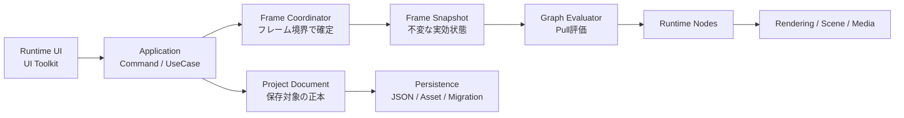

# アプリケーションアーキテクチャ

## 状態

初期版アーキテクチャは確定。大まかな構成、型と状態の所有、asmdef依存、処理境界、永続化、診断、テストおよびPresentationを個別文書で定義する。

本ディレクトリは、`docs/SPECIFICATION/` と `docs/GUI/` を実現する内部設計の正本とする。要求または外部動作は仕様書が所有し、本ディレクトリは実現方式と内部責務を所有する。

## 採用する構成

Unity Standaloneアプリケーション内のモジュラーモノリスとする。単一プロセス、単一VJプロジェクト、単一Composition Rootを使用し、機能領域をasmdefと明示的な依存方向で分離する。

## 確定した設計判断

### モジュラーモノリス

- 配布物と実行単位は1つのUnity Standaloneアプリケーションとする。
- 内部を責務別モジュールへ分割し、モジュール境界をasmdefで表現する。
- 初期版では別プロセス、ECS／DOTS、ランタイムプラグイン基盤および汎用イベントバスを導入しない。

### 保存状態と実行状態の分離

- `ProjectDocument` を保存、Undo／RedoおよびProject Dirty判定の正本とする。
- `RuntimeSession` はノード実体、Scene、GPUリソース、診断、動画再生状態など、実行中に派生する状態を所有する。
- `FrameSnapshot` は1評価フレームで参照する確定済みの実効状態を表す。
- Unity Object、RenderTexture Lease、診断履歴、Undo履歴および一時的な再生状態を `project.json` へ保存しない。

### フレーム境界での状態確定

- UI、物理入力およびバックグラウンド処理は、評価中の状態を直接変更しない。
- 変更要求はコマンドまたはイベントとしてキューへ投入する。
- `FrameCoordinator` を仕様で定義されたフレーム処理順序の唯一の実行主体とする。
- グラフ編集、パラメーター更新、論理入力およびプリセットを評価開始前に確定し、同一フレームのノードは同じ `FrameSnapshot` を参照する。

### コンパイル済みPull評価

- Programと表示中Previewを評価起点とし、必要な上流ノードだけをPull評価する。
- グラフ変更時に接続、型互換性および循環を検証し、`EvaluationPlan` を生成または更新する。
- 通常フレームでは確定済み `EvaluationPlan` を使用し、同じノードを1フレームに最大1回だけ評価する。
- 評価途中でグラフ構造を再解析または変更しない。

### Runtime UI Toolkit

- Standalone内GUIはRuntime UI Toolkitを使用する。
- ノードキャンバス、ドック、InspectorおよびDashboardはアプリケーションAPIを介して状態を参照・変更する。
- ノード固有UIは明示登録されたFactoryで生成し、生成失敗時は標準パラメーターUIへフォールバックする。
- Presentation層からRuntime Node実装または永続化実装へ直接書き込まない。

### 手動Composition Root

- 起動時のComposition Rootがモジュールの実装を明示的に組み立てる。
- DIフレームワークは使用しない。
- 外部I/O、Unity APIおよびテストで差し替える必要がある境界に限ってインターフェースを設ける。
- 具体的な必要性が確認される前に汎用Repository、汎用Service Locatorまたは抽象基底フレームワークを作らない。

## モジュール

| モジュール | 主な責務 |
|---|---|
| Core | 安定ID、値型、Result、診断の共通契約 |
| Project | 保存可能なプロジェクトモデル、検証、Dirty、Undo／Redo |
| Graph | グラフ編集コマンド、接続検証、評価計画 |
| Runtime | FrameCoordinator、FrameSnapshot、GraphClock、RuntimeSession |
| Rendering | ImageFrame、RenderTexture Pool、Program／Preview提示 |
| Nodes | ノード定義、Factory、組み込みRuntime Node |
| Scene | 3D／2D Additive Scene、Physics、Layer貸出 |
| Media | 素材カタログ、動画Backend、Hap連携境界 |
| Input | Keyboard入力、論理コントロール、更新キュー |
| Persistence | JSON、素材ファイル、移行、バックアップ、復旧 |
| Presentation | Runtime UI ToolkitによるGUI |
| Bootstrap／Editor | Composition Root、ノードカタログ生成、ビルド時検証 |

モジュール境界の詳細は [ModuleBoundaries.md](ModuleBoundaries.md) で管理する。

## 設計原則

- 保存可能な宣言状態と、実行時の派生状態を混在させない。
- Unity APIを呼ぶ処理と、純粋な検証・変換処理の境界を明示する。
- 回復可能な失敗をResultまたは判別可能な状態で表し、通常制御に例外を使用しない。
- Unity APIからの予期しない例外はモジュール境界で捕捉し、診断へ変換する。
- 不明型、参照切れおよび移行失敗の生データを削除しない。
- Programの継続と品質を、GUIおよびPreviewより優先する。
- 現在の仕様に必要な拡張点だけを実装し、将来用途だけの抽象化を導入しない。

## 初期版で採用しない構成

- ECS／DOTSを中心としたノード実行
- 複数プロセスまたはマイクロサービス
- Service Locatorまたはグローバルな可変Singletonによる依存取得
- 文字列トピックを使う全体イベントバス
- 実行時Reflection走査によるノード登録
- 外部Assemblyのホットロード
- 複数VJプロジェクトの同時実行

## 詳細設計文書

| 文書 | 内容 | 状態 |
|---|---|---|
| [ModuleBoundaries.md](ModuleBoundaries.md) | モジュール責務と依存方向 | 確定 |
| [StateModel.md](StateModel.md) | ProjectDocument／RuntimeSession／FrameSnapshot | 確定 |
| [FrameLifecycle.md](FrameLifecycle.md) | フレーム処理、コマンド、更新キュー | 確定 |
| [GraphRuntime.md](GraphRuntime.md) | グラフ編集、評価計画、ノード契約 | 確定 |
| [ExecutionPerformance.md](ExecutionPerformance.md) | Burst、Job System、GPU、非同期処理の使い分け | 確定 |
| [ResourceOwnership.md](ResourceOwnership.md) | Scene、Texture、動画リソースの所有権 | 確定 |
| [Persistence.md](Persistence.md) | DTO、JSON、移行、UnknownNode、素材トランザクション | 確定 |
| [Presentation.md](Presentation.md) | UI状態、ドック、Pending表示 | 確定 |
| [Diagnostics.md](Diagnostics.md) | 障害境界、診断、回復 | 確定 |
| [Testing.md](Testing.md) | 単体、統合、Player受け入れ、性能試験 | 確定 |
