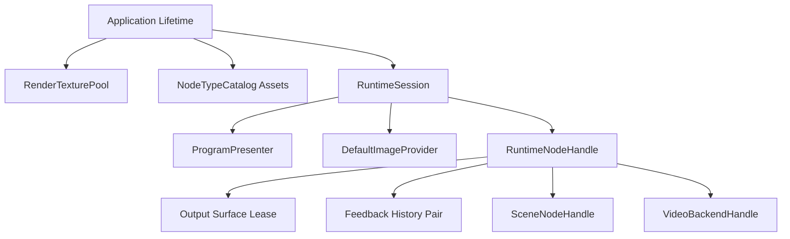
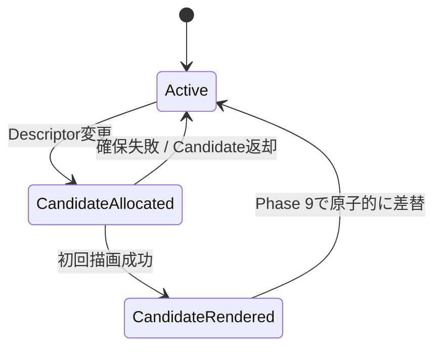

# リソース所有権

## 状態

確定。RenderTexture、出力Lease、Program保持Texture、既定映像、Additive Scene、Layer、Materialおよび動画Backendの所有と破棄順を定める。

## 目的

- Node、接続先、UIのいずれも借用リソースを破棄できない構造にする。
- ライブ編集中のNode削除、Undo、解像度変更およびProject切り替えで、使用中リソースを回収しない。
- 非同期生成・破棄の完了通知を、削除後に復元された別Generationへ誤適用しない。
- VRAM不足またはBackend障害をアプリケーションクラッシュではなく、局所的なFaultedとして扱う。
- Programの最後の正常フレームを、上流Nodeの寿命から独立して保持する。

## 所有権の原則

- リソースを生成したモジュールが最終破棄責任を持つ。
- Runtime Nodeはサービスから借りたHandleを保持できるが、サービス内部のUnity Objectを直接破棄しない。
- 入力Port、ImageFrame受信側およびPresentationは常に借用参照として扱う。
- 所有Handleと借用Viewを別の型にし、借用Viewへ `Dispose`、`Release` またはPool参照を公開しない。
- Releaseは所有サービスだけが実行し、二重Releaseまたは所有者不一致を診断する。
- Unity Objectの破棄をFinalizerへ依存させない。
- Project終了時はSession IDによる一括回収を安全網として持つが、通常経路では個別所有者が決められた順序で返却する。

## 所有階層



- `RenderTexturePool` はApplication Lifetimeで1つだけ存在する。
- Projectを同時に1つだけ開くため、RuntimeSessionは最大1つをCurrentとして持つ。
- Catalog内のShaderおよびテンプレートMaterial、`Scene3DDefinition` のPrefab、`BootstrapAssets` 内の既定3D／2D PrefabはUnity Assetであり、参照側は破棄しない。
- Runtime Nodeが複製したMaterial、生成したPrefab InstanceおよびBackendはRuntime Node Generationが所有する。

## RenderTexture Pool

### Texture Descriptor

再利用条件を完全に表す不変値とする。

- Width、Height
- GraphicsFormat
- Depth／Stencil Format
- MSAA Samples
- MipMap有無
- RandomWrite
- Texture Dimension
- Volume Depth
- sRGB無効

Descriptorが完全一致するTextureだけを再利用する。比較時に省略値または推測による同一視を行わない。

### Pool Entry

PoolはRenderTextureごとに次を追跡する。

- Texture Instance
- Descriptor
- 推定Byte数
- `Free` または `Leased`
- 現在のOutputLeaseId
- Owner Session ID
- Owner Resource Key
- 最終返却時刻
- 作成および最終利用FrameNumber

Poolの外へPool Entry自体を公開しない。

### Leaseの識別

`OutputLeaseId` はApplication実行中に再利用しない単調増加IDとする。所有対象は次の汎用Resource Keyで識別する。

```text
SessionId + OwnerKind + OwnerId + OwnerGeneration + SlotId + LeaseRole
```

`OwnerKind` はRuntime Node、Program Presenter、Default Image Providerなどを区別する。Runtime Nodeの場合はOwnerIdをNodeInstanceId、OwnerGenerationをGenerationId、SlotIdをPortIdとする。Program HoldやDefault Imageでは、その所有者に固有の安定IDとSlotを使う。

`LeaseRole` は通常出力、Depth、Feedback Previous、Feedback Next、Program Hold、Default Imageなどを区別する。

- OutputLeaseIdは診断と整合性検証に使い、Textureの所有権そのものを外部へ移さない。
- NodeInstanceIdがUndoで復元されてもGenerationIdが違えば別所有者として扱う。
- Release要求のResource Keyと現在Lease所有者が一致しない場合はTextureを返却せず診断する。

### 型の境界

- Pool内部は破棄権限を持つ `TextureLeaseHandle` を使用する。
- Runtime Nodeへは書込み可能だが破棄不能な `BorrowedOutputSurface` を渡す。
- 下流NodeとPresentationへは読み取り専用の `ImageFrame` を渡す。
- `ImageFrame.Texture` はUnity API上のRenderTexture参照を含むが、契約上は読取専用であり、Release、DiscardContents、Resizeまたは書込みを禁止する。

## 出力Port Lease

- Node作成時には取得しない。
- Demand Plannerが出力Portを初めて要求したPhase 5で取得する。
- Nodeが非表示、未到達、Disabledまたは一時的に未接続になっても保持する。
- Node削除、出力仕様変更またはProject終了時に返却する。
- 1つの出力PortへActive Leaseを最大1つ、仕様切り替え中だけCandidate Leaseを最大1つ持てる。

### 仕様切り替え



1. Active Leaseを維持したままCandidate Leaseを確保する。
2. Candidate Surfaceへ当該フレームの出力を生成する。
3. Size、GraphicsFormat、LeaseIdおよびNodeOutputResultを検証する。
4. Availableの場合だけPhase 9でCandidateをActiveへ昇格する。
5. 旧ActiveをPoolへ返却する。
6. 確保、描画または検証失敗時はCandidateだけを返し、旧Activeと旧正常フレームを維持する。

差し替えは全Node評価とPresentationが完了したPhase 9で行い、同一フレームの下流が返却済みTextureを参照しないようにする。

## Programの最後の正常フレーム

Program Presenterは1920×1080の専用 `Program Hold Lease` をRuntimeSession期間中保持する。

- Program入力がAvailableのPhase 8で、表示変換前の内部Program映像をHold Textureへコピーする。
- コピー成功後にだけHold FrameNumberと正常状態を更新する。
- Program入力がBlocked、FaultedまたはPreparingならHold Textureを書き換えない。
- 正常フレームがまだない場合はHold Textureを不透明黒へ初期化する。
- 外部DisplayとProgram Monitorは上流NodeのImageFrameではなく、Program Presenterの安定した提示Surfaceを参照する。
- 上流Nodeが削除されLeaseを返却しても、Program Hold Leaseは影響を受けない。
- RuntimeSession終了時にDisplay参照を外してからHold Leaseを返却する。

内部Premultiplied Alphaを保持するSurfaceと、黒背景へ合成したDisplay用Surfaceを実装上分ける必要がある場合も、両方をProgram Presenterが所有する。具体的なSurface数はRendering実装時の検証で決め、外部へ所有権を公開しない。

## 既定映像

`DefaultImageProvider` はRuntimeSession単位で、次のKeyによる共有読み取り専用Textureを遅延生成する。

```text
Texture Descriptor + TransparentBlack / OpaqueBlack / OpaqueWhite
```

- Textureは共通PoolからSystem Leaseとして取得し、VRAM予算へ含める。
- Nodeごとには複製しない。
- 下流へImageFrameとして渡すが書込みを禁止する。同じTextureを使っても、ImageFrame自体には利用した評価フレームのFrameNumberを設定する。
- Project終了時に全Default Image Leaseを返却する。
- Candidate確保のために予算が不足した場合は通常出力と同じ確保失敗として扱う。

## Feedback履歴

Feedback Runtime Node Generationが、同一Descriptorの2つのLeaseを1組として所有する。

- Pair取得では2つとも確保できた場合だけ採用する。
- 片方の確保に失敗した場合は取得済みCandidateも返却し、現在Pairを維持する。
- PreviousはPhase 6で読み取り専用出力として公開する。
- NextはPhase 7の履歴コピー先だけに使用する。
- Phase 7のコピー成功後にRoleを交換し、Texture自体を返却・再取得しない。
- Resetは両方を透明黒へ初期化し、次の評価から新しい履歴として扱う。
- Descriptor変更では新Pairを先に確保し、透明黒で初期化後に旧Pairと差し替える。
- Node削除またはProject終了時に2つをまとめて返却する。

## SceneとLayer

### SceneNodeHandle

SceneモジュールがNode Generationごとに次をまとめて所有する。

- Additive Scene
- Local Physics Scene
- Layer Lease
- Prefab Instance
- 専用Camera
- Node内Light、Renderer、ColliderおよびCanvas参照
- Physicsの未処理時間
- Scene生成・Unloadの非同期Operation

Runtime Nodeは `SceneNodeHandle` の限定APIを使い、SceneまたはLayerを直接解放しない。

### 生成トランザクション

1. Layer 8～31から1つを予約する。
2. Local Physics Mode付きAdditive Sceneを作る。
3. Prefabを生成して専用Sceneへ移動する。
4. 子を含む全GameObject、Camera、Light、RendererおよびCanvasを設定する。
5. Camera数、Canvas Mode、Culling Mask、必要Componentを検証する。
6. すべて成功した場合だけHandleをReadyにする。

途中失敗ではCameraを停止し、生成済みObjectを破棄し、SceneをUnloadする。LayerはScene Unload完了後にだけ返却する。生成・清掃中のNodeはPreparing、失敗確定後はFaultedとする。

### 削除

1. Phase 1でNodeをEvaluationPlanから外し、HandleをRetiringにする。
2. CameraとPhysics更新を停止する。
3. Phase 9でNodeの出力Leaseを返却する。
4. Scene Unloadを開始する。
5. 完了通知をGeneration ID付きCompletion Queueへ送る。
6. Completion適用時にSceneが無効であることを確認し、LayerをPoolへ返す。
7. HandleをDisposedにする。

Retiring中のLayerは使用中として数える。削除直後にLayerが空いていなければ、新しいScene Node追加を待機させず仕様どおり拒否する。

## MaterialとCatalog Asset

- CatalogのShaderとテンプレートMaterial、`Scene3DDefinition` のPrefab、および `BootstrapAssets` の既定3D／2D PrefabはAsset参照であり、RuntimeSessionは破棄しない。
- Node Factoryが複製したMaterialはRuntime Node Generationが所有する。
- 共有テンプレートMaterialを実行中に変更しない。
- Node削除時はMaterialを使用する描画が完了したPhase 9以降に破棄する。
- Factory生成途中で失敗した場合も、生成済みMaterialを同じGenerationのCleanupへ登録する。

## 動画Backend

### 共通所有

Video Runtime Node Generationが `IVideoBackendHandle` を1つ所有する。

- Codec Probe結果によりUnityVideoBackendまたはHapVideoBackendを選ぶ。
- 素材変更時は旧BackendをRetiringへ移し、新Generation相当のBackend Stateを準備する。
- Prepare、Seek、Frame Ready、ErrorのCallbackはNodeInstanceIdとGeneration IDを持つCompletionへ変換する。
- Node削除または素材変更後に届いた古いCallbackを現在Backendへ適用しない。

### UnityVideoBackend

- VideoPlayer Componentと、そのHost GameObjectをBackendが所有する。
- `VideoPlayer.texture` はVideoPlayer所有の借用Textureとし、NodeまたはPoolが破棄しない。
- 評価時は借用TextureからPool所有の出力Surfaceへ変換・コピーする。
- Dispose開始時にCallbackを解除し、再生とPrepareを停止してからHost Objectを破棄する。

### HapVideoBackend

- Native Decoder Context、MOV Sample情報、展開BufferおよびBackend固有GPU TextureをBackendが所有する。
- Pool所有の最終ImageFrame Textureとは所有を分ける。
- Native Callbackは破棄開始後に無効化し、進行中処理の完了またはCancellation確認後にNative Contextを解放する。
- GPU CommandがBackend固有Textureを参照中の場合は、対応する完了境界より前にTextureまたはNative Bufferを解放しない。
- Backend経路の切り替えはProject保存形式へ影響させない。

## Project切り替えと終了

Current RuntimeSessionのCommit済み終了順を次へ固定する。

1. 新しいGraph、ParameterおよびRuntime Commandの受付を停止する。
2. ProgramとPreview以外の評価起点を外し、新しいNode評価を開始しない。
3. Program／Displayへ最後の安定した提示Surfaceを維持する。
4. 全Runtime NodeをRetiringへ移し、Callbackとバックグラウンド処理をCancelする。
5. Camera、Physics、VideoPlayerおよびNative Decoderの新規処理を停止する。
6. Node出力、Feedback、Default ImageのLeaseを返却する。
7. Additive Scene UnloadとBackend Cleanupの完了を回収する。
8. DisplayとUIからProgram提示Surfaceを外し、Program Hold Leaseを返却する。
9. Session IDに残るLease、Scene、LayerおよびBackendがないことを検証する。
10. Candidate RuntimeSessionをCurrentへ切り替えてリソース準備を開始する。

アプリ終了時は同じ順序を使い、最後にRenderTexturePoolのFree Textureをすべて破棄する。強制終了に備えた最終Cleanupも冪等にするが、正常終了時の主経路として依存しない。

## 予算と確保失敗

- PoolはDescriptorから推定Byte数を計算し、LeasedとFreeを分けて集計する。
- 85%警告は最初の到達と回復だけを履歴へ記録し、現在値はRead Modelで更新する。
- 新規確保前に予算を確認し、Free LRU Textureを必要量だけ破棄する。
- Leased Textureを予算回収目的で奪わない。
- 確保失敗はResultで返し、要求NodeをFaultedにする。
- Program Hold Leaseの既存Textureを予算不足で回収しない。
- ユーザーが予算を既存Leased合計未満へ下げる変更を拒否する。

## 整合性検証

Development Buildとテストでは、次を確認できるOwnership Snapshotを提供する。

- SessionごとのLease数と推定Byte数
- Node Generationごとの出力、Feedback、Scene、LayerおよびBackend
- Retiring開始からの経過Frame
- 所有者不明、二重Release、Generation不一致
- Project終了後に残るリソース

Ownership Snapshotは診断用の読み取り専用データであり、そこからリソースを変更できない。
