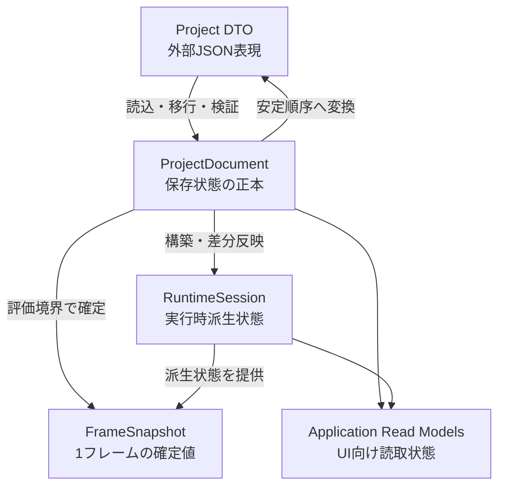

# 状態モデル

## 状態

確定。保存状態と実行状態の分離、状態所有、Revision、Dirty判定、読込切り替えおよび保存完了規則を定める。

## 目的

- 保存可能なユーザー構成と、Unity Objectを含む実行状態を混在させない。
- 同一評価フレームでノードが異なる値を見る状態を作らない。
- 保存または読込の失敗で、現在の正常なプロジェクトを失わない。
- UIが可変な内部コレクションまたはRuntime Nodeを直接操作できないようにする。

## 状態の分類

### Project DTO

Persistenceモジュールだけが所有する外部表現とする。

- `project.json` のフィールド、欠落、未知データおよび形式バージョンを表す。
- JSONの構文解析に成功しただけのDTOを、正常なProjectDocumentとして扱わない。
- ノード移行は元DTOのコピーへ適用し、失敗時に入力データを変更しない。
- UnknownNodeの生状態は、解釈できない内容を失わない表現で保持する。

### ProjectDocument

現在開いているVJプロジェクトの保存可能な正本とする。

所有するもの:

- ノード、接続、ノード位置およびBaseValue
- 論理コントロール、物理入力割り当ておよび合成式
- プリセット
- 素材メタデータと相対参照
- DashboardおよびPreviewのプロジェクト固有状態
- Program Display選択
- Broken参照とUnknownNodeの復旧用データ

所有しないもの:

- EffectiveValue
- Runtime Node、GameObject、Scene、MaterialおよびVideoPlayer
- RenderTextureとLease
- 現在のGraphClock時刻
- 診断履歴
- Undo／Redo履歴自体
- UI選択、スクロール、検索語およびArrange状態

`ProjectDocument` はメインスレッド上の可変オブジェクトとするが、変更経路をProject Command Processorへ限定する。各コレクションは外部へ読み取り専用で公開し、Presentation、InputおよびRuntime Nodeへ可変参照を渡さない。

### RuntimeSession

1つのProjectDocumentから派生した、現在の実行セッションを表す。

- NodeInstanceIdからRuntime Node Handleへの対応
- ノードのPreparing、Available、Blocked、Faulted状態
- `EvaluationPlan` と、その生成元Graph Revision
- Parameter Storeと最新EffectiveValue
- GraphClockと動画Transport状態
- Scene、Layer、Texture Leaseなどの借用Handle
- Feedback履歴
- Programの最後の正常フレーム
- Preview品質状態
- セッション診断と性能計測

RuntimeSessionは保存しない。ProjectDocumentの変更をフレーム境界で差分反映し、ノード削除またはプロジェクト終了時に所有・借用リソースを決められた順序で解放する。

### FrameSnapshot

1回のノード評価で共有する読み取り専用状態とする。

- FrameNumber
- GraphClock時刻とPause状態
- Document RevisionとGraph Revision
- 確定済みEffectiveValue
- 確定済みLogical Control値とPresetTrigger結果
- Programおよび表示中Previewの出力要求
- そのフレームで使用するEvaluationPlan

FrameSnapshotの寿命は評価開始から提示・後処理完了までとする。その間は内容を変更しない。Texture自体の所有権は含めず、ImageFrameとLease IDを通して参照する。

初期実装では正しさを優先し、Snapshotの実体を明確な値の集合として作る。割り当てが性能上の問題だと計測された場合に限り、寿命を守った二重バッファまたはプールへ置き換える。

### Application Read Models

Presentationが表示に使用する、読み取り専用の投影状態とする。

- ProjectDocumentとRuntimeSessionの内部型をそのまま公開しない。
- BaseValueとEffectiveValueを同じ行で参照できる形へ投影する。
- Pending、Broken、Preparing、Faultedなどの表示状態を型で区別する。
- Viewからの変更はRead Modelへ書き戻さず、Application Commandへ変換する。

## RevisionとDirty

用途の違う2種類の識別子を分ける。

### Document Revision

- ProjectDocumentへ確定変更が適用されるたびに単調増加する。
- RuntimeSession、Read Modelおよび非同期処理結果の鮮度判定に使用する。
- Undoで以前と同じ内容へ戻っても値を巻き戻さない。
- 保存済みかどうかの判定には使用しない。

### State Token

- 各Undo可能状態へ一意な不透明Tokenを付ける。
- コマンド適用時は新しいTokenを作る。
- Undo／Redoでは履歴上の状態に対応するTokenも復元する。
- 保存開始時のTokenを `SavingToken`、最後に保存成功したTokenを `SavedToken` とする。
- `CurrentToken != SavedToken` の場合だけProject Dirtyとする。

この分離により、Undoで最後に保存した状態へ戻った場合はDirtyを解除できる。一方、実行中の差分同期は単調増加するDocument Revisionで取りこぼしを防げる。

## コマンドによる変更

すべての変更を1種類の巨大なコマンドへ統合せず、性質ごとに経路を分ける。

| 経路 | 対象 | 特徴 |
|---|---|---|
| GraphEditCommand Queue | ノード、接続、置換、削除 | フレーム境界で検証、Undo対象 |
| ProjectEditCommand | プリセット、Dashboard、素材メタデータなど | 保存状態を変更、必要なものだけUndo対象 |
| Parameter Update Queue | BaseValue、Value、PresetTrigger | 高頻度更新を合流、SequenceNumber順 |
| Runtime Command | Feedback Reset、GraphClock Pauseなど | 保存状態を変更しない操作 |
| Completion Queue | ファイル、Probe、動画準備などの完了 | バックグラウンドからメインスレッドへ戻す |

- 各コマンドは対象IDと、必要な場合は要求時のRevisionを持つ。
- 適用時に対象、型、上限および参照を再検証する。
- 検証失敗ではProjectDocumentとRuntimeSessionの両方を変更しない。
- ProjectDocument変更後にRuntimeリソース生成が失敗した場合、保存状態は維持し、対象Runtime NodeをFaultedまたはPreparingとして表す。

## プロジェクト読込

現在のプロジェクトを守るため、読込を次の2段階に分ける。

### Commit前

1. 主ファイルと必要な場合は `.bak` を候補DTOへ読む。
2. 構文、ProjectFormatVersion、必須IDおよび基本参照を検証する。
3. 必要なら元データを残して移行用バックアップを作る。
4. DTOのコピーへ連続Schema移行を適用する。
5. 候補ProjectDocumentを構築し、カタログ、上限、接続および必須システムノードを検証・修復する。
6. Unityリソースをまだ取得しない候補RuntimeSession構造を作る。

ここまでの失敗では、現在のProjectDocumentとRuntimeSessionを変更しない。

### Commit後

1. 現在のRuntimeSessionを評価起点から外す。
2. 旧SessionのTexture、Scene、動画Backendを安全な順序で解放する。
3. 候補ProjectDocumentと候補RuntimeSessionを現在値へ切り替える。
4. Runtime Nodeの生成および非同期準備を開始する。
5. 準備中はPreparing、個別生成失敗はFaultedとしてプロジェクト自体は開いた状態を維持する。
6. 読込補正、移行または `.bak` 復旧があった場合は新しいState Tokenを発行してDirtyにする。

Unity LayerとGPU予算を旧新Sessionが同時に奪い合わないよう、Commit前の候補SessionはUnityリソースを取得しない。

## プロジェクト保存

1. メインスレッドでProjectDocumentから保存用Snapshotと `SavingToken` を取得する。
2. Snapshotを安定順序のDTOへ変換する。
3. 一時ファイルへの書込み、読戻し検証、`.bak`、原子的置換を実行する。
4. 完了結果をCompletion Queueでメインスレッドへ戻す。
5. 成功時は `SavedToken = SavingToken` とする。
6. 保存中に追加編集があって `CurrentToken != SavingToken` なら、保存成功後もDirtyを維持する。
7. 失敗時はSavedTokenを変更せず、既存 `project.json` とDirty状態を維持する。

保存SnapshotはUnity ObjectまたはRuntimeSessionへの参照を含めないため、ファイルI/O中もProgram評価を継続できる。

## スレッド境界

- ProjectDocument、RuntimeSession、FrameSnapshotの生成と切り替えはメインスレッドだけで行う。
- ファイル読書き、ハッシュ計算およびUnity APIを使わないProbeはバックグラウンド実行できる。
- GameObject、Scene、RenderTexture、Material、Shader、VideoPlayerおよびInput System Objectはメインスレッドだけで操作する。
- バックグラウンド処理は不変の入力Snapshotを受け取り、完了結果をCompletion Queueへ返す。
- 完了結果のRevisionまたは対象IDが古い場合は現在状態へ適用せず、必要に応じて診断だけを残す。
