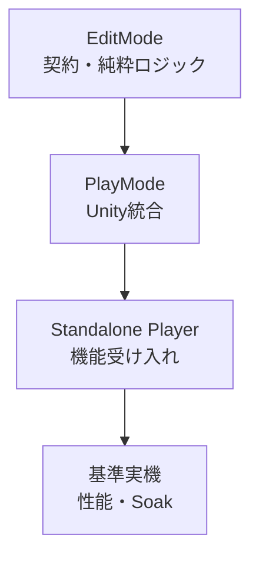

# テスト戦略

## 状態

確定。テスト層、Assembly、テストダブル、決定性、機能契約、GPU／Native検証、GUI受け入れおよびFHD・60fps性能試験を定める。

## 目的

- 保存状態、フレーム境界およびグラフ評価の決定性を、Unity Editor外でも保証する。
- RenderTexture、Scene、Layer、動画BackendおよびNative Pluginの寿命事故を検出する。
- Windows D3D12／VulkanとmacOS Metalの差を、実際のStandalone Playerで検証する。
- 仕様の受け入れ条件と自動テストまたは実機確認結果を対応付ける。
- テスト数や行カバレッジ率ではなく、壊れたときの影響が大きい契約を優先する。

## 現在のテスト基盤

- `com.unity.test-framework` `1.7.0` は `Packages/manifest.json` の直接依存として存在する。
- 現在、独自テストコードとテスト用asmdefは存在しない。
- Performance Test Frameworkは推移的依存としてpackages-lockに存在するだけで、アプリケーションの直接依存ではない。
- 初期の10分性能試験はStandalone用Harnessで計測する。
- Micro BenchmarkでPerformance Test Frameworkを使用する変更を行う場合は、その変更と同時にmanifestの直接依存へ追加する。

## テスト層



下の層ほど件数を多く、上の層ほど実環境への忠実度を高くする。同じ条件を全層で重複検査せず、各層でしか発見できない障害へ集中する。

### EditMode

Unity Objectまたは実フレーム進行を必要としない契約を高速に検証する。

- 安定ID、値型、Result、Diagnostic集約
- ProjectDocument、State Token、Dirty、Undo／Redo
- GraphEditCommand、接続検証、循環、EvaluationPlan
- Demand統合と安定順序
- Parameter、Value Mapping、Preset Transaction
- DTO検証、移行、UnknownNode、正規化
- Application Read Modelの投影

EditModeテストからScene、Camera、RenderTexture、VideoPlayerまたは実ファイルI/Oへ触れない。必要な境界はTest Doubleへ置き換える。

### PlayMode

Unity RuntimeとUnity Objectの実装境界を検証する。

- FrameCoordinatorのLateUpdate統合
- RenderTexture生成、Lease、Candidate差し替え、LRU
- Shader、GraphicsFormat、色、Alpha、Fit／Fill／Stretch
- Additive Scene、Local Physics、Layer貸出、Unload
- UnityVideoBackend
- Runtime UI ToolkitのVisual Treeと入力
- Project切り替え時のUnityリソースCleanup

PlayModeのGPUテストはGraphics Deviceを必要とするため、`-nographics` 相当の環境だけを合格根拠にしない。

### Standalone Player受け入れ

製品と同じPlayer Buildで、Editor依存の混入、Graphics API、Native Plugin、Display、ファイル権限および実Codecを検証する。

- Windows x64 D3D12
- Windows x64 Vulkan
- macOS arm64 Metal
- H.264、VP8 Alpha、Hap、Hap Alpha、Hap Q、Hap Q Alpha
- 保存、終了、再起動、復旧
- ProgramとPreviewの同時提示
- Runtime UI操作の主要シナリオ

### 性能・Soak

仕様の基準PCと基準グラフで10分間実行し、Frame Time、欠落、Fault、VRAMおよび未回収リソースを判定する。Editor上のProfiler結果だけを合格判定に使わない。

## テストAssembly

### 共通Test Kit

`ShitDesigner.Tests.Shared` をテスト専用asmdefとして作る。Test Assemblyからだけ参照し、Production Assemblyから参照しない。

含めるもの:

- Project、Graph、Node DefinitionのBuilder
- 固定IDと固定SequenceNumberのFactory
- `ManualClock`
- `FakeRuntimeNode` と `RecordingRuntimeNode`
- `FakeVideoBackend`
- `FakeCapabilityProbe`
- `FakeTextureLeaseService`
- `RecordingDiagnosticSink`
- Fault注入可能なFile System Port
- Ownership SnapshotとDiagnosticのAssertion Helper

Mocking Frameworkは初期導入せず、契約が明確な小さいFakeを使う。FakeがProduction実装を再実装し始めた場合は、Test Contractを見直す。

### EditMode asmdef

各Production asmdefに対応する必要最小限のTest asmdefを置く。

- `ShitDesigner.Core.Tests.EditMode`
- `ShitDesigner.Project.Tests.EditMode`
- `ShitDesigner.Graph.Tests.EditMode`
- `ShitDesigner.Runtime.Tests.EditMode`
- `ShitDesigner.Persistence.Tests.EditMode`
- `ShitDesigner.Application.Tests.EditMode`

### PlayMode asmdef

- `ShitDesigner.Runtime.Tests.PlayMode`
- `ShitDesigner.Rendering.Tests.PlayMode`
- `ShitDesigner.Scene.Tests.PlayMode`
- `ShitDesigner.Media.Tests.PlayMode`
- `ShitDesigner.Presentation.Tests.PlayMode`

### Player Harness

`ShitDesigner.TestHarness` はテスト用Player Buildだけへ含めるRuntime asmdefとする。

- Production Bootstrapと同じComposition Rootを使用する。
- テスト専用のScenario選択、入力再生、計測、Artifact書き出し、終了Codeだけを追加する。
- Productionコードの内部状態を変更する裏口を作らず、公開Application APIと読み取り専用Snapshotを使用する。
- Define Constraintで通常の製品Buildから除外する。

## 決定性

- GraphClockは `ManualClock` から明示時刻を供給する。
- FrameCoordinatorはテストから1Tickずつ進められる薄いDriver境界を持つ。
- UUID v4を生成するProduction Factoryを差し替え、テストでは固定IDを使う。
- SequenceNumberを明示し、スレッドの偶然の到着順を期待値にしない。
- ランダム試験は固定Seedを記録し、失敗時にSeedと操作列を書き出す。
- `Task.Delay`、固定秒待ちまたは「数フレーム待てば終わる」という期待を使わない。
- 非同期試験は状態Conditionを期限付きで待ち、Timeout時にCurrent Condition、HistoryおよびOwnership Snapshotを出力する。
- Dictionary列挙順、ファイル列挙順およびUnity Object Instance IDを期待値にしない。

## 命名と仕様対応

テスト名は `対象_条件_期待結果` の順で、失敗名だけから契約が分かるようにする。

各受け入れテストは、対象仕様文書と見出しをCategoryまたはテストMetadataに持つ。

```text
ReplaceConnection_InvalidCycle_KeepsExistingConnection
Preset_WithBrokenItem_RejectsWholeTransaction
TextureLease_CandidateRenderFails_KeepsActiveLease
```

仕様変更で契約が変わった場合は、仕様、アーキテクチャ、テストを同じ変更単位で更新する。

## 契約テスト

### Projectと編集履歴

- Command以外からProjectDocumentを変更できない。
- Document Revisionは単調増加し、Undoでも巻き戻らない。
- UndoでSaved Tokenへ戻るとDirtyが解除される。
- 保存中の追加編集では保存成功後もDirtyが残る。
- Undo／Redoの分岐と200件上限がState Tokenを壊さない。
- Broken参照とUnknownNodeが編集、Undoおよび正規化で失われない。

### Graph

- 完全一致Portと登録済み暗黙変換だけを接続できる。
- 情報を失う変換を暗黙接続できない。
- 入力置換失敗で既存接続を維持する。
- Feedbackなしの循環を拒否する。
- Feedbackを時間境界としてPlanがDAGになる。
- Connection 4096件上限を越える変更を拒否する。
- Fan-outで送信元Nodeを1フレーム1回だけ評価する。
- Graph保存順を変えても同じEvaluationPlan安定順序になる。
- Node位置、表示名または折り畳み変更でGraph Revisionが増えない。

### Frame Lifecycle

- Queue切り離し後のCommandが次フレームへ送られる。
- Phase 1～9が定義順に1回だけ実行される。
- Graph Batch WorkspaceのPlan生成失敗でDocumentを変更しない。
- 同一対象の合流可能更新だけが最新値へまとまる。
- Preset Transactionが部分適用されない。
- FrameSnapshot作成後の入力が同一フレームへ混入しない。
- Program枝がPreview専用枝より先に評価される。
- 更新期限が来ていないPreviewがDemandへ入らない。
- Frame全体例外でFeedbackをCommitしない。

### Parameterと論理入力

- NaN、Infinity、型不一致、無効Enumを拒否する。
- Hard RangeとControl Rangeの順でクランプする。
- SequenceNumber最大の有効BaseValueを採用する。
- Valueの0～1正規化、反転、型変換およびRound規則を再現する。
- Min／Max式の循環、不完全、Broken葉をApplyできない。
- PresetTriggerの0.5発火、0.4未満再Armおよび同一フレーム重複排除を再現する。

### 診断

- Blocked、Preparing、UsingFallback、HoldingLastFrameがHistoryを増やさない。
- Fault開始時に1件だけ追加する。
- 同じFaultが300フレーム継続しても新規行を作らずCountを更新する。
- 回復時に1件追加しCurrent Faultを解除する。
- 評価対象外になったFaulted Nodeを回復扱いしない。
- 1000件を超えたHistoryが最古Entryから上書きされる。
- Background ResultがPhase 0より前にHubを変更しない。
- Exception Objectを保持せず型、Message、Stackへ変換する。

## 不変条件と生成テスト

外部Property-based Test Libraryは初期導入せず、固定Seedの生成テストをTest Kitへ実装する。

- 有効なGraphへAdd、Delete、Connect、Disconnect、Undo、Redoを数千回適用する。
- 各操作後にID一意性、単一入力、接続上限、非循環およびPlan Revision一致を検査する。
- 全操作をUndoしたCanonical Projectが開始状態と一致することを検査する。
- Demand入力順を並べ替えても統合解像度と安定順位が同じになることを検査する。
- ProjectのDictionary／Connection順を並べ替えても同じCanonical JSONになることを検査する。
- 失敗時はSeedと最小化前の操作列をArtifactへ残す。自動Shrinkingは初期版で実装しない。

## Fault注入

予測可能な失敗をTest Doubleまたは限定Test Hookから注入する。

- N回目のTexture確保失敗
- Candidate初回描画失敗
- Feedback Pairの2枚目確保失敗
- Scene生成、Prefab検証、Unload失敗
- Node EvaluateまたはConverter例外
- Completion Queue上限到達
- Node削除後の古いGeneration Callback
- Video Prepare、Seek、Decode失敗
- project.json一時書込み、読戻し、置換、`.bak`失敗
- Migration途中失敗
- 素材コピー途中失敗とHash不一致

Fault注入APIはTest Assemblyまたは注入Port内に閉じ、Production UIから呼べないようにする。

## Resourceテスト

### Texture

- 初回DemandまでLeaseを取得しない。
- Disabled、未到達またはPreview非表示でも取得済みLeaseを維持する。
- Descriptor完全一致だけを再利用する。
- Candidate成功時だけActiveをPhase 9で差し替える。
- Candidate失敗時にActiveとProgram Holdを維持する。
- Budget到達時にFree LRUだけを破棄する。
- 二重Release、Owner不一致およびGeneration不一致を検出する。
- Project終了後にSession所有Leaseが0になる。

### Scene

- 3D／2Dの各Nodeが別Scene、別Physics、別Layerを持つ。
- Prefab配下とCamera／LightのLayerが統一される。
- 24個使用中に25個目を拒否する。
- Scene Unload完了前にLayerを再貸出ししない。
- 削除、Undo復元、古いUnload Completionで新GenerationのLayerを返却しない。
- Project終了後に未回収SceneとLayerがない。

### Video

- Backend選択がProbe結果と一致する。
- Callback解除後のCompletionを現在Nodeへ適用しない。
- Unity VideoPlayer TextureをPoolが破棄しない。
- Hap Native ContextとBackend固有Textureを最終Output Leaseから独立して破棄する。
- 評価対象外から復帰したときGraphClockの現在位置へ追いつく。

## GPU映像テスト

小さい固定解像度のRenderTextureへ描画し、GPU Readback結果を期待値と比較する。

- ImageFrameのSize、GraphicsFormat、FrameNumber、LeaseId
- Linear入力とsRGB／Rec.709境界
- Straight AlphaからPremultiplied Alphaへの変換
- HDR値が1を超えて保持されること
- ACES表示変換とLDR経路の分離
- TransparentBlack、OpaqueBlack、OpaqueWhite
- Bilinear拡縮
- Fitの透明余白、Fillの中央Crop、Stretch
- Feedback初回、Commit、Reset、Descriptor変更

浮動小数Pixel比較はGraphics Formatと変換ごとに許容差を明示する。Screenshotだけを合否判定に使わず、Screenshotは失敗Artifactとして保存する。

## 動画Fixture

### 機能Fixture

短い決定的Clipをテスト用Fixtureとして管理する。

- H.264 MP4
- VP8 WebM Alpha
- Hap／Hap Alpha／Hap Q／Hap Q Alpha MOV
- 音声Track付きだが音声を無視するClip
- 欠損、非対応Codec、Hash不一致用Fixture

各Fixtureは生成元、ライセンス、解像度、Frame Rate、Codec、期待Frame値およびXXH3-128をManifestへ記録する。機能Fixtureは短く保ち、オフラインでテストできるようにする。

### 性能Fixture

FHD 60fpsのH.264とHapを、Version付きPerformance Corpusとして別管理する。

- Corpus ManifestとXXH3-128をRepositoryへ置く。
- 大容量実体は基準試験機へ明示的に配置し、実行前にHashを検証する。
- Fixture欠落をテスト成功としてSkipせず、性能試験の環境不備として失敗させる。
- Corpus Versionが異なる結果を直接比較しない。

## GUIテスト

### Controller／Read Model

EditModeで次を検証する。

- Project DirtyとLayout Dirtyの分離
- Pendingから成功／拒否への遷移
- BaseValue編集とEffectiveValue読取専用
- Broken Widget、Unknown PanelおよびUnknownNodeの保持
- Preview最大8件
- Diagnostics Filter
- テキスト入力中のGraph Shortcut抑止

### Visual Tree

PlayModeでRuntime UI Toolkitの実Visual Treeを検証する。

- 1280×720の最小Windowで固定領域が重ならない。
- UI Scale 100%、125%、150%で操作部品のBoundsが欠けない。
- Dock分割、Tab化、Resize、閉じる、再表示
- Keyboard Focus RingとTab順
- Port型と状態が色以外の記号・文字でも存在する。
- Reduce Motionで対象Transitionが無効になる。
- Custom UI Factory失敗時に標準UIへ戻る。

### Standalone手動確認

OS Displayと人間の視認が必要な項目だけを、Version付きChecklistで確認する。

- 追加Displayへの全画面Program
- Display切断時のProgram Monitorフォールバック
- Identify DisplaysがProgram映像へ重ならないこと
- 実際の色、文字可読性、Keyboard操作感

手動項目を自動テストで検証済みと記録しない。結果には実施者、日時、Build、OS、Display構成を残す。

## Persistence受け入れテスト

- 保存したProjectを閉じて再度開き、Canonical Projectが一致する。
- 保存失敗で既存project.jsonとSaved Tokenを維持する。
- 主ファイル破損時に有効な `.bak` をRecovered／Dirtyで開く。
- 主と `.bak` の両方が無効ならCurrent Projectを維持する。
- vNからvN+1を順番に適用し、飛び越し移行しない。
- 移行前Backupを5世代へ整理する。
- 未知型、新しいSchemaVersion、移行失敗をUnknownNodeとして生データごと保持する。
- 素材がProject相対パスだけで別Rootへ移動できる。
- 素材コピー完了前の参照をManifestへ確定しない。
- 保存中の強制中断をFixture File Systemで再現し、最後の正常ファイルを失わない。

## Standalone性能Harness

### 実行条件

- Productionと同じURP設定とNodeTypeCatalogを使う。
- 計測前に30秒のWarm-upを行い、Shader Compile、動画Prepareおよび初期Texture確保を完了させる。
- Warm-up後にFrame統計と診断をResetし、仕様どおり10分を計測する。
- 3D Generator、2D Generator、Shader Effect、VideoPlayer、2入力合成Shader、Feedback、ProgramOutputをProgram経路へ含める。
- 640×360・30fps Previewを2つ表示する。
- Logical Controlを毎秒120更新し、PresetTriggerを10秒に1回発火する。
- H.264試験とHap試験を別Runにする。

### 計測

- Program Presented FrameごとのCPU Frame TimeとGPU Frame Time
- 16.67ms以内のFrame比率
- 連続Program欠落数
- Program内部解像度とGraphicsFormat
- Preview品質段階
- Texture PoolのLeased／Free／High Water Byte数
- Scene、Layer、BackendおよびNative Context数
- GC AllocationとCollection回数
- Faulted、FatalおよびHoldingLastFrame区間

### 合格

- 10分区間の99%以上が16.67ms以内
- Program内部解像度が全期間1920×1080
- 連続3フレーム以上のProgram欠落なし
- FaultedとFatalなし
- VRAM予算超過なし
- 終了後の未回収Scene、Layer、Texture LeaseおよびBackendなし
- Preview品質低下は許可するがProgram解像度または目標頻度を下げない

### Platform

- Windows基準PCのD3D12を主合格判定にする。
- 同じWindows BuildをVulkanで機能検証し、性能結果も別Artifactへ記録する。
- MacBook Pro M4／16GBのMetalで同じ合格判定を行う。
- macOS Version、GPU Driver相当情報、Unity Version、Build ID、Project RevisionおよびCorpus Versionを結果へ含める。

## 実行頻度

| 契機 | 実行するテスト |
|---|---|
| ローカル変更中 | 対象ModuleのEditMode |
| 変更統合前 | 全EditMode、関連PlayMode、Build時Catalog検証 |
| 定期実行 | 全PlayMode、Windows Player Smoke、保存Round Trip |
| Release候補 | 全対応Graphics API機能試験、GUI Checklist、10分性能試験、終了Leak検査 |

Native Plugin、Rendering、PersistenceまたはFrame Lifecycleを変更した場合は、定期実行を待たず関連Player試験を行う。

## Flaky Test

- Retryで一度通った結果を合格にしない。
- Timeout、Frame待ち、OS／GPU差、Fixture差をArtifactから判定できるようにする。
- 不安定Testを無期限にIgnoreしない。
- 一時的に隔離する場合は理由、再現条件、影響する仕様および解除条件を同じ変更へ記録する。
- 時間待ちを増やす前に、観測すべきConditionとCompletion境界を確認する。

## Failure Artifact

失敗時は可能な範囲で次を同じRun Directoryへ保存する。

- Test名、Seed、操作列
- Application Log
- Diagnostic Text／JSON Export
- Ownership Snapshot
- Canonical Projectまたは最小再現Project
- Screenshotと必要なRenderTexture Readback
- CPU／GPU Frame Time統計
- Platform、Graphics API、Build ID、Package Version
- Native Plugin経路とCodec Probe結果

Artifact保存自体の失敗で元のTest Failureを上書きしない。

## カバレッジ方針

- 初期版では一律のLine Coverage率を合格条件にしない。
- 仕様上の分岐、失敗経路、所有権遷移および保存復旧をContract Matrixで追跡する。
- 新しいDiagnosticCode、GraphEditCommand、MigrationまたはResource Stateを追加した場合は、成功、拒否／失敗、回復／Cleanupのテストを追加する。
- 発見した不具合は、修正前に再現Testを追加できる場合は追加し、同じ原因の再発を防ぐ。
